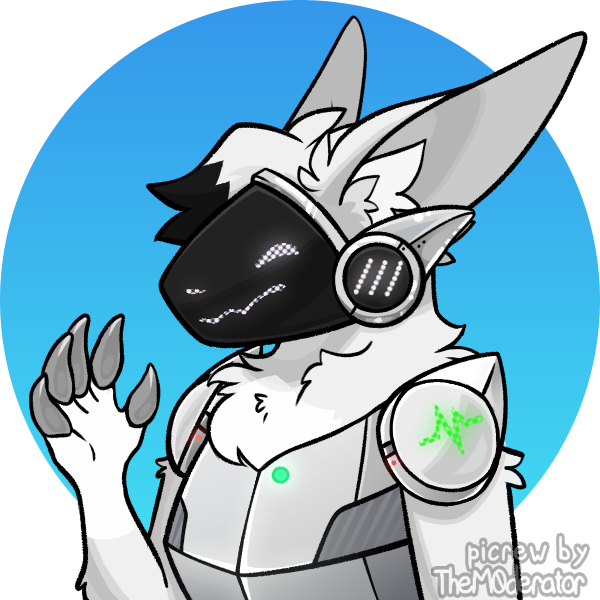

# iota（Protogen）

iota 是一位常见等级的 Protogen。是作者的人格投射之一。

## 基础设定

- 种族：Protogen（Common）
- 性别：男
- 人称代词：他
- 身高：155 cm
- 体重：42 kg

*图：iota 的设计。保留了水印。*

### 关系

- 他的创造者是他自己。即使不是，但他的创造者数据也可能是因为一场意外而全部不见了，所以只能这样认为。

### 身份

## 人物特点

iota 是作者的人格投射之一。

### 身体构造

iota 就像是穿上了胸甲和股甲的毛茸茸的生物。不过他的胸甲和股甲是脱不下来的。iota 的毛发基本都是白色的。

iota 有一组耳朵。他的耳朵形状有点像狃拉的左耳，不过里面长有毛发。他的前额有一撮比较长的毛，末端是黑色的。

iota 的面罩是黑色的。里面通过光的点阵表示自己的表情。发光时使用的颜色一般是白色。iota 的舌头藏在面罩里面。奇怪的是，iota 说话时没有那种电子音的感觉。

还不清楚 iota 的面部鳍板处显示的是什么内容。可能是模拟腮红的效果。

iota 胸前的毛比他其他地方的毛更白一些。

似乎 iota 可以把他的肢体拆下来，但是这个世界里面没有给他备用的肢体。他现在的上肢有白色的毛发，末端有五个手指，长着很不锋利的爪子。看起来没有肉垫。

iota 的下肢形状和捷拉奥拉类似，有三个脚趾，但末端没有爪子。同样没有发现有肉垫出现。毛发颜色也基本全是白色的。

iota 肩部的两个显示器是他的 HP 指示器。图形形状和颜色和剩余 HP 比例有关。HP 比较健康时是绿色的，而不高于 50% 时颜色会变黄，不高于 20% 时会变红，而 HP 为 0 时，也就是没有力气战斗的时候，颜色是灰色的。注意这不代表他的死亡。

### 宝可梦？

由于一场意外，他从不知道哪个世界线掉落到了宝可梦世界中。

阿尔宙斯、帝牙卢卡、帕路奇亚和骑拉帝纳对他的到来紧急召开了应对会议，讨论怎么把他合法地并入宝可梦世界。会议一下子就开完了，而结果如下：

- iota 和其他所有人一样，被视为一种宝可梦。他的训练师是他自己，所以不能被其他人收服。这一点和不可思议迷宫系列中的宝可梦类似。
- iota 的属性是电 + 钢，种族值分配是 HP 70，物攻 58，物防 104，特攻 137，特防 98，速度 103，总和 570。
- iota 的固件管理全权交给阿尔宙斯。
- 不要给 iota 太多的镜头。至少是暂时。

## 人物历史

### “零之红”意外

- 由于一场意外，他从不知道哪个世界线掉落到了宝可梦世界中。这场意外被命名为“零之红”。但是为什么被这么命名呢……
- 而由于这场意外，他看起来丢失了全部的有关之前世界的记忆。*Kate：这我熟。*
