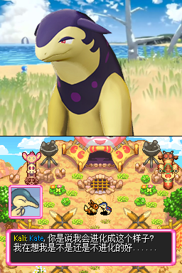

# 空之探险队的 Kali

Kali 是一位火球鼠。

## 基础设定

- 种族：火球鼠
- 性别：男
- 人称代词：他
- 身高：58 cm
- 体重：8.3 kg

### 关系

- 是 Kate 的搭档。

### 身份

- 口袋之友探险队创始人之一。
- 口袋之友探险队“Main”分组成员。

## 人物特点

Kali 曾经是一个胆小的孩子。在经历了许多事情之后，他变得勇敢、坚强而不屈。

### 没有选择进化

一个原因是，进化与否非常不影响能力。

另一个原因是，进化后不可爱。Kali 还是更喜欢现在自己的样子。*和 Kate 一样都是扮猪吃老虎的类型。*

*图：Kali 对洗翠火暴兽的长相感到疑惑*

## 人物历史

### 空之探险队剧情

- Kate 和 Kali 组成了口袋之友探险队。
- ……
- Kate 和 Kali 打败了黑暗帝牙卢卡，阻止了星之停止。
- Kate、Kali 和克雷色利亚彻底地粉碎了达克莱伊的所有邪恶行动的可能性。
