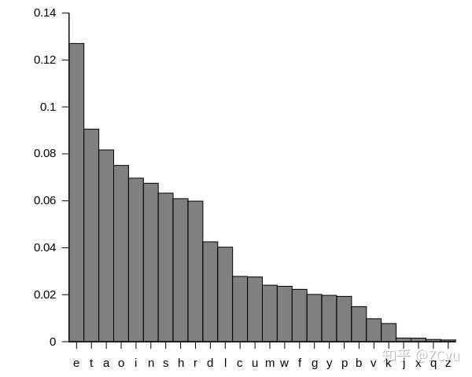
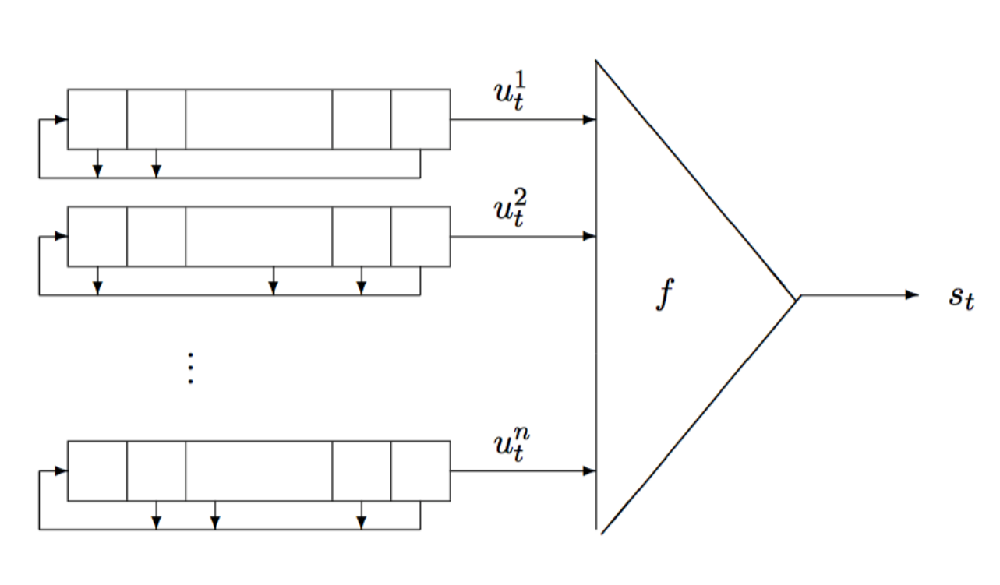

# 第 5 天：密码学基础

## 基本术语

明文：消息。

密文：被加密的消息。

加密：让明文变成密文。

解密：让密文变成明文。

密码算法：用于加密和解密的数学函数。

密钥：加密或解密所需要的除密码算法之外的关键信息。

## 数学基础

- 整出
- 素数，互素
- gcd
- 模运算，同余
- 逆元

## 古典密码

- 代换密码（substitution）：用新的替换原先的内容。
- 置换密码（permutation）：打乱原先的顺序。
- Hill 密码
- 其他……

### 代换密码

将明文中的一个字母由其他字母、数字或符号替代的一种方法。

- 凯撒密码
- 仿射密码
- 单表代换
- 多表代换

#### 凯撒密码（Caesar）

```plain
>>> A B C D E F G H I J K L M N O P Q R S T U V W X Y Z
<<< D E F G H I J K L M N O P Q R S T U V W X Y Z A B C
```

数学描述：

$C = E(P) = (P + K) \mod 26$ (C: Cipher, E: Encrypt, P: Plain, K: Key)

$P = D(C) = (C - K) \mod 26$ (D: Decrypt)

#### 仿射密码（Affine）

$y = E(x) = ax + b \mod n ~ (\gcd(a, n) = 1)$

$x = D(y) = a^{-1} (y - b) \mod n$

#### 单表代换密码

密码表是乱的的凯撒密码。

#### 多表代换密码

利用多个表进行加解密，比如维吉尼亚密码。

这些密码都没有改变统计规律。对于英文，每个字母的出现频率都是不一样的。



### 手撕维吉尼亚密码

步骤：

- 确定密钥的长度。
- 确定密钥的内容。
- 根据密钥恢复明文。

维吉尼亚密码的密钥是循环重复的。如果我们知道了密钥的长度 m，破解难度就会降低。

将相同字母组找出来，然后求距离差的最大公约数 gcd()，由此猜测 m。

频率排序：

两个字母： th, he, in, er, re, on, an, en

三个字母： the, and, tio, ati, for, tha, ter, res

确定了秘钥长度 m 之后，可以把密文的第 x 个，第 m + x 个，第
2m + x 个……密文字母提取出来组成一个新的文本，这个抽取出来的文本，都是由秘钥的第
一个字符加密得到的，就相当于一个凯撒密码。

然后利用重合指数法爆破它们。

### 置换密码

分组后对每一组中进行一个更换。

### 栅栏密码

把明文分割成 k 行，然后重新拼接。

```plain
crypto basic -> k = 3:
cp s
rtbi
yoac
-> cp srtbiyoac
```

### Hill 密码

利用可逆矩阵加密解密。

## 编码算法

编码算法不是加密算法，因为编码本身的过程没有密钥，只是用于将信息用其他形式进行表示的一种方法。

- ASCII & Unicode & UTF-8
- Hex & Bin 表示
- Base64
- 摩斯密码
- 培根密码

### Unicode

Unicode 为世界上所有字符都分配了一个唯一的数字编号，这个编号范围从 0x000000 到 0x10FFFF。

#### UTF-8

是变长的。

|编号范围|二进制格式|
|:--:|:--|
|0x00 - 0x7f|0xxxxxxx|
|0x80 - 0x7ff|110xxxxx 10xxxxxx|
|0x800 - 0xffff|1110xxxx 10xxxxxx 10xxxxxx|
|0x10000 - 0x10ffff|11110xxx 10xxxxxx 10xxxxxx 10xxxxxx|

### Hex & Bin 表示

在计算机上的存储方法。比如“abc”的 hex 表示就是 616263，bin 表示就是 01100001 01100010 01100011。

### Base64

是一种将 byte 数组编码为字符串的方法，而且编码出的字符串只包含 ASCII 基础字符。

## 隐写术

隐写的信息通常用一些传统的方法进行加密，然后用某种方法修改一个“伪装文本”（covertext），使其包含被加密过的消息，形成所谓的“隐秘文本”（stegotext）。例如，文字的大小、间距、字体，或者掩饰文本的其他特性可以被修改来包含隐藏的信息。

## 流密码

利用密钥 k 产生一个密钥流 z = z0z1z2...（长度无限，明文有多长，密钥流就有多长）然后与明文进行 x = x0x1x2... 操作（例如异或），得到密文。

密钥流由密钥流发生器生成，为了保证安全新，使密钥流生成器要有不可预测性，具体表现如下：

- 长周期
- 高线性复杂度
- 统计性能良好
- 足够的“混乱”
- 足够的“扩散”
- 抵抗不同形式的攻击

### RC4 算法

### 伪随机生成器

- 线性同余生成器（Linear congruential generator，LCG）
- 线性反馈移位寄存器（linear feedback shift register，LFSR）
- MT19937（Python Random 库内部实现）

### 线性同余生成器（LCG）

$X_{n+1} = (aX_{n} + c) \mod m$

### 线性反馈移位寄存器（LFSR）

```python
N = 100
MASK = 2**(N+1) - 1

def lfsr(state, mask):
	feedback = state & mask
	feed_bit = bin(feedback)[2:].count("1") & 1
	output_bit = state & 1
	state = (state >> 1) | (feed_bit << (N-1))
	return state, output_bit
```

### 非线性反馈移位寄存器（NLFSR）



### MT19937

- 利用 seed 初始化 624 个 int 构成的状态。
- 对状态进行旋转。
- 根据状态提取伪随机数。

```python
def _int32(x):
	return int(0xFFFFFFFF & x)

class MT19937:
	def __init__(self, seed):
		self.mt = [0] * 624
		self.mt[0] = seed
		self.mti = 0
		for i in range(1, 624):
		self.mt[i] = _int32(1812433253 * (self.mt[i - 1] ^ self.mt[i - 1] >> 30) + i)

	def twist(self):
		for i in range(0, 624):
			y = _int32((self.mt[i] & 0x80000000) + (self.mt[(i + 1) % 624] & 0x7fffffff))
			self.mt[i] = (y >> 1) ^ self.mt[(i + 397) % 624]
			if y % 2 != 0:
				self.mt[i] = self.mt[i] ^ 0x9908b0df

	def extract_number(self):
		if self.mti == 0:
			self.twist()
		y = self.mt[self.mti]
		y = y ^ y >> 11
		y = y ^ y << 7 & 2636928640
		y = y ^ y << 15 & 4022730752
		y = y ^ y >> 18
		self.mti = (self.mti + 1) % 624
		return _int32(y)
```

#### 逆向 extract_number

`y = y ^ y >> 18`：y 的高 18 位没有改变。

```plain
|14bit   |18bit      |
|           |14bit   |
```

`y = y ^ y << 15 & 4022730752`：可以推出 y 的低 15 位。

```plain
|15bit   |17bit      |
|17bit      |000...00|
|4022730752          |
```

并进一步推出低 30 位以及以后的位数。

```plain
|15bit   |2bit|15bit      |
|2bit|*15bit* |000...00   |
|4022730752               |
```

像这样一路逆下去就好了。

#### 预测随机数

```python
def generate():
	fw = open("random", "w")
	for i in range(700):
	fw.write(str(random.getrandbits(32))+"n")
	fw.close()

generate()
f = open("flag.txt", "w")
key = str(random.getrandbits(32))
ciphertext = encryption(flag, key)
f.write(ciphertext)
f.close()
```

加密时的 key 是第 701 个随机数……用前面 624 个随机数逆出初始的状态！

## 现代密码

- 对称密码：加解密时使用的密钥相同
- 非对称密码：加解密时使用的密钥不相同，分为公钥，私钥。公钥是可以公开的（即
他人可以知道），而私钥需要被保护（只有自己知道）。

### 对称密码

加密和解密采用相同的密钥。

#### DES

是一种对称密码，但是由于计算机的性能提升，这个算法的安全性已经很低了。

- 输入：64 位
- 输出：64 位
- 密钥：64 位中的 56 位

#### 3DES

就是 DES 三次。

为什么 2 次不行？考虑 Meet in the middle。

#### AES

- 输入：128 位
- 输出：128 位
- 密钥：128 位，192 位，256 位

### 非对称密码

加解密时使用的密钥不相同，分为公钥，私钥。公钥是可以公开的，而私钥需要被保护。

- RSA
- ECC

## RSA

### 欧拉函数，欧拉定理

$\phi(n) =$ 小于等于 n 的正整数中有多少个和 n 互质。

$a^{\phi(n)} = 1 \mod n,~ \gcd(a, n) = 1$

### 公钥和私钥的生成

有两个巨大的质数 p，q。

N = pq。$\phi(N) = \phi(p) \phi(q) = (p-1)(q-1)$。

找一个 e 让 $e < \phi(N),~ \gcd(e, \phi(N)) = 1$。

此时会有 d 让 $d = e^{-1} \mod \phi(N)$，即 $de = 1 \mod \phi(N)$。

把 p 和 q 扫进遗忘的尘埃后，(N, e) 是公钥，(N, d) 是私钥。

对 N 的质因数分解非常困难，也就难以得到 $\phi(N)$。即使知道公钥的 e 也基本得不到私钥的 d。

> 今年寒假我就是靠这个成功转专业的。

### 加密和解密

传递一个小于 N 的整数 m。

$m^e \equiv c \mod N$。

传递 c。

$c^d \equiv m \mod N$。

### 正确性？

$$
\begin{aligned}
c^d & = (m^e)^d \\
& = m^{ed} \\
& = m^{1 + k\phi(N)} \\
& = m \times m^{k\phi(N)} \\
& = m \mod N ~(\gcd(m, N) = 1)
\end{aligned}
$$

$\gcd(m, N) \neq 1$：

$$
\begin{aligned}
& n = pq \Rightarrow m = sp ~\mathrm{or}~ m = rq. \\
& \mathrm{let} ~ m = sp. \\
& m^{\phi(q)} = 1 \mod q \\
& m^{q-1} = 1 \mod q \\
& m^{k(p-1)(q-1)} = 1 \mod q \\
& m^{k \phi(N)} = 1 \mod q = tq + 1 \\
& m \times m^{k \phi(N)} = (tq + 1)m \\
& m^{k \phi(N) + 1} = tqm + m = tq \times sp + m = tsN + m \\
& m^{k \phi(N) + 1} = m \mod N
\end{aligned}
$$

### ECC

和椭圆曲线有关。

## 今天的作业

!!! warning "警告"
	抄袭行为是严厉禁止的。

### 扩展欧几里得算法

这个算法可以求解 $ax + by = 1$ 的一组 x 和 y（gcd(a, b) = 1）。

$(a, b) = (b, a \bmod b) = (b, a - b \lfloor \frac{a}{b} \rfloor)$。

如果现在有 x'，y' 满足 $bx' + (a - b \lfloor \frac{a}{b} \rfloor) y' = 1$，就可以用 x'，y' 反推出 x，y。

那么此时 $a(x - y') + b(y - x' + \lfloor \frac{a}{b} \rfloor y') = 0$。

由于 gcd(a, b) = 1，那么只能让 $x = y', y = x' - \lfloor \frac{a}{b} \rfloor y'$。

### 挑战部分

??? done "提示"
	原函数逻辑是这样的：

	```plain
	[flag 207..0                             ] = R_0
	[flag 206..0     ][bcnt(R_0 & mask) & 1  ] = R_1
	[flag 205..0  ][*][bcnt(R_1 & mask) & 1  ] = R_2
	...
	[flag 0][********][bcnt(R_206 & mask) & 1] = R_207
	[****************][bcnt(R_207 & mask) & 1] = R_208 = tmp
	```

	考虑把这个过程反过来执行。

	现在我们有 tmp：tmp 的最右边一位是上次序列与上 mask 后的 1 的奇偶性。

	上次序列可以通过这次序列往右移一位得到，但是最左边一位是丢失的。

	不过可以找回来。这次序列往右移一位，左边补 0 再与上 mask，如果奇偶性不对的话说明左边应该补一个 1。

	逆 208 次就好了。
