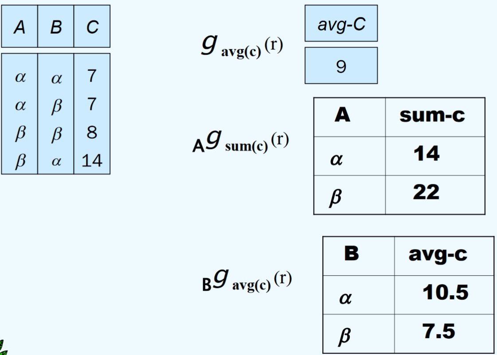

# 第 2 章：关系模型

> 简单又优雅。

一个使用关系模型的数据库储存了一些关系；一个“关系”是包含行和列的表。

!!! caution "注意"
	关系 relation 指的是一张表，联系 relationship 指的是一些实体之间的关联。

## 基本结构

对于集合 $D_1, D_2, \cdots$，它们的关系 $r$ 是它们笛卡尔积 $D_1 \times D_2 \times \cdots$ 的一个子集。

### 属性 Attribute

每个属性都有其（值）域 domain。根据第一范式，属性的值需要是原子化的，也就是说不能是多个值组合起来。

|id|name|gender|species|tags|
|--:|:--|:--|:--|:--|
|1|妙艾拉|女|魔幻假面喵|挚友、美食家、…… **←这样不行！**|

所有的域里面都包含 null 这个值。虽然 null 总会让数据处理变得复杂……

### 关系模式 Relation Schema

关系模式描述了一个关系的结构，比如：

``Instructor-schema = (ID: string, name: string, dept_name: string, salary: int)``

现在有属性 $A_1, A_2, \cdots, A_n$，那么 $R = (A_1, A_2, \cdots, A_n)$ 称为一个关系模式；$r(R)$ 是在关系模式 R 下的一个关系。

### 关系实例 Relation Instance

关系实例是某个时候关系里面的数据的快照。

如果现在有元组 t，那么 $t[A]$ 代表元组 t 中名为 A 的属性的值。

### 关系的特性

- 无序
- 不重

### 码 Keys

为了让 K（$K \subset R$）成为关系模式 R 的超码（Superkey），它需要满足只用 K 里面的属性就可以唯一确定所有的元组。比如对于下面这个：

|id|name|gender|species|
|--:|:--|:--|:--|
|1|妙艾拉|女|魔幻假面喵|
|624|蒙洛卡|男|魔幻假面喵|
|993|皎华|女|月亮伊布|

让 $K = \{\mathrm{id}\}$ 可以，$K = \{\mathrm{name}\}$ 可以，$K = \{\mathrm{gender}, \mathrm{species}\}$ 也可以；但是 $K = \{\mathrm{gender}\}$ 和 $K = \{\mathrm{species}\}$ 都不行。

而其中，候选码（Candidate Key）是所有超码里面**极**小的那几个，也就是候选码的真子集不能再组成超码。所以 $K = \{\mathrm{gender}, \mathrm{species}\}$ 也是一个候选码。

主码（Primary Key）是用户选定的一个候选码，表示的时候要打一个<u>下划线</u>。比如我们可以让 $K = \{\mathrm{id}\}$ 变成主码，因为名字还是太容易重复了：

Teammates(<u>id</u>, name, gender, species)，这样。

此时我们拿来宝可梦图鉴 Pokédex(<u>species</u>, ...)，那么属性 ``species`` 叫做 Teammates 引用 Pokédex 的一个外码。Teammates 是参照关系（referencing relation），Pokédex 是被参照关系（referenced relation）。参照关系中，外码的值必须在被参照关系中实际存在或为 null，所以你不能把什么祖利兽加进 Teammates 里面，因为他不是宝可梦。

## 六个基本操作

### 选择 $\sigma_{p}(r)$

设选择谓词 p 是一堆条件组成的约束，那么 $\sigma_{p}(r) = \{t | t \in r \land p(t)\}$ 是 r 中满足 p 的元素。

比如 $\sigma_{\mathrm{affection} \geq 255}(\mathrm{pokemon})$ 会返回所有友好度大于等于 255 的宝可梦。

### 投影 $\Pi_{A_1 \cdots A_k}(r)$

设 $A_1 \cdots A_k$ 是属性的名字，那么 $\Pi_{A_1 \cdots A_k}(r)$ 是从 r 中只选出属性 $A_1 \cdots A_k$ 后组成的表。注意因为这是个集合，所以得去重。

### 并

$r \cup s = \{t | t \in r \lor t \in s\}$，其中 r 和 s 需要等目（属性的个数一样），并且相应的属性可以合并起来。

比如 $\Pi_{\mathrm{name}}(\mathrm{trainer}) \cup \Pi_{\mathrm{name}}(\mathrm{pokemon})$ 会返回所有训练师和宝可梦的名字（在一张表上）。

### 差

$r - s = \{t | t \in r \land t \notin s\}$，和上面一样，其中 r 和 s 需要等目（属性的个数一样），并且相应的属性可以合并起来。

### 广义笛卡尔积

$r \times s = \{\{t, q\} | t \in r \land q \in s\}$，其中如果 r 和 s 里面有属性的名字相同，那么必须给个新名字以区分。

### 重命名 $\rho_{x}(E); ~\rho_{x(A_1, \cdots, A_n)}(E)$

现在有个有 n 个属性的关系 E，$\rho_{x(A_1, \cdots, A_n)}(E)$ 会返回一个属性名字被改成 $A_1, \cdots, A_n$ 的 E。

## 附加的操作

### 交

$r \cap s = \{t | t \in r \land t \in s\} = r - (r - s)$。

### 自然连接

$r \bowtie s = \Pi_{r 和 s 下的所有属性种类}(\sigma_{r 和 s 下相同的属性名的值都相同}(r \times s))$。

设 r 在模式 R 下，s 在模式 S 下，那么 $r \bowtie s$ 是在模式 $R \cup S$ 下的表。

### 除

$r \div s = \{t | t \in \Pi_{R - S}(r) \land \forall_{u \in s} (tu \in r)\}$；或者说，得出来的商来自于 $\Pi_{R - S}(r)$，里面的元组 t 和 s 里面任何元组的拼接结果都在 r 里面出现过。

### 赋值

符号是 $\leftarrow$。比如上面的除操作可以写成这样：

$temp1 \leftarrow \Pi_{R-S}(r)$

$temp2 \leftarrow \Pi_{R-S}((temp1 \times s) - \Pi_{R-S, S}(r))$（缺少了 s 的出现的元组）

$result = temp1 - temp2$

## 扩展的关系代数操作

### 广义投影

投影中包含数学表达式的投影。比如下面这个：

$\Pi_{\mathrm{name, maxhp - hp}}(\mathrm{pokemon})$ 会返回所有宝可梦的名字和他们已经损失的 HP 量。

### 聚合函数和聚合操作

包括最大值、最小值、平均值等操作。

### 外连接

在自然连接的基础上，增加左外连接和右外连接，以及完全外连接。

遇到部分值冲突的时候，左外连接保留符号左边的表的数据，右外连接保留符号右边的表的数据。

这个时候完全外连接说“我全都要！”，那么只能在冲突元组的其他属性中的其中一个放上 null 了。

### 空值 null

对于 or：

- (unknown or true) = true
- (unknown or false) = unknown
- (unknown or unknown) = unknown

对于 and：

- (unknown and true) = unknown
- (unknown and false) = false
- (unknown and unknown) = unknown

对于 not：

- not unknown = unknown

### 数据库的修改操作

删除可以表达为 $r \leftarrow r - E$。

插入可以表达为 $r \leftarrow r \cup E$。

更新可以表达为 $r \leftarrow \Pi_{F_1, F_2, \cdots, F_l} (r)$，其中 $F_i$ 对于哪些要更新的元组是相应的表达式。