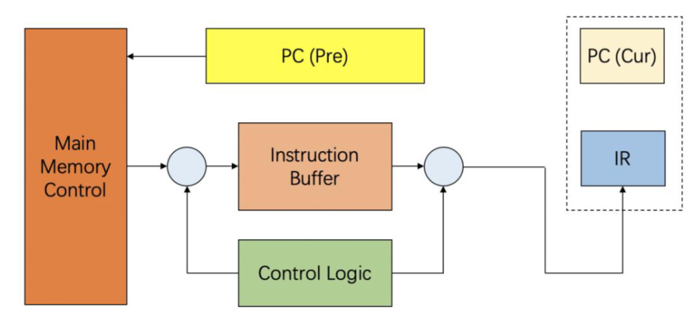
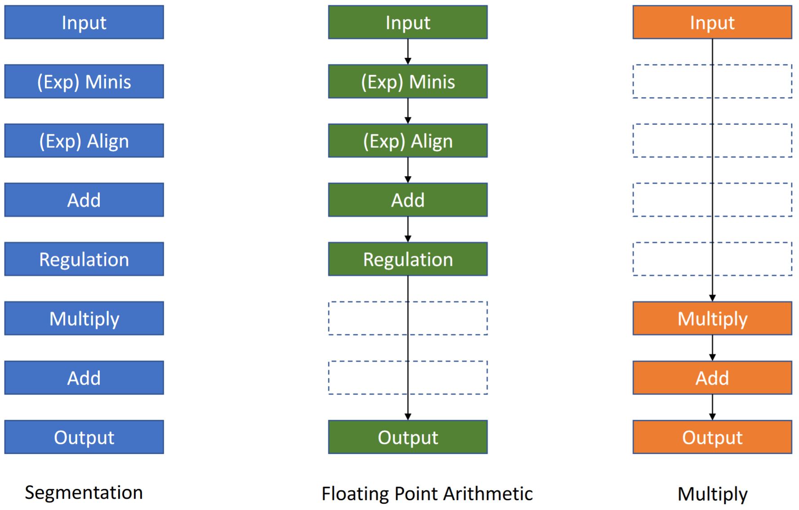
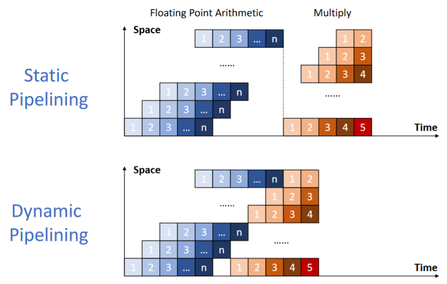
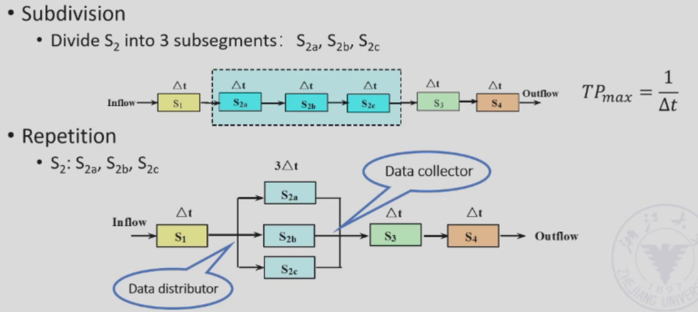

# 第 2 周

## 不同的指令执行模式

现在把一个指令分成三个部分：

- Instruction Fetch
- Instruction Decode
- Execution

### 顺序执行 Sequential Execution

```plain
[IF k  ][ID k  ][EX k  ][IF k+1][ID k+1][EX k+1]
```

### 二重重叠执行 Twice Overlapping Execution

把下一个指令的 IF 和它上一个指令的 ID 对上：

```plain
[IF k  ][ID k  ][EX k  ]
        [IF k+1][ID k+1][EX k+1]
```

- 执行时间下降了近 2 / 3。
- 各个单元的使用率大幅增加了。

但是其中如果时长不是很能对上的话，可能会出现：

```plain
[IF k  ][ID k      ][EX k  ]
        [IF k+1]    [ID k+1    ][EX k+1]
		              [IF k+2]    [ID k+2    ][EX k+2]
                           |<-->| Waste of Resources
```

```plain
[IF k  ][ID k  ][EX k        ]
        [IF k+1][ID k+1][EX k+1      ]
                        |<-->| Multiple Overlapping
```

以及……

- 需要大量的硬件设计。
- 需要单独的 FETCH，DECODE 和 EXECUTION 组件。

既然如此，那么我们把下一个指令的 IF 和它上一个指令的 EX 对上：

```plain
[IF k  ][ID k  ][EX k  ]
                [IF k+1][ID k+1][EX k+1]
```

- 执行时间下降了近 1 / 3。
- 各个单元的使用率增加了。
- 不过，硬件上需要一些额外的设计。

### 内存的冲突

有个问题。如果我要读指令，那么我要访问内存。而如果我要访问数据，那我也要访问内存。 

上面那种重叠的执行方式肯定会出现那种读指令和读数据要同时进行的场合。怎么办？

我们可以搞一个暂时存储指令的结构。



### 一重重叠执行 Single Overlapping Execution

如果读指令的时间非常非常短，那么我们可以认为 IF 可以合并到 ID 里面。

```plain
[ID k  ][EX k  ]
        [ID k+1][EX k+1]
```

## 那么，什么是流水线呢

一个指令被分成 m（大于 2）个同样长度的部分，而 m 个部分的执行可以重叠。

- 可以认为是重叠执行的扩展。
- 每个子过程都应该在一个时钟周期内完成。这些子过程叫做流水线的阶段（stages / segments）。
- 分成的子过程的个数 m 叫做流水线的深度。
- 每个子过程都有一个特殊的单元实施的。它们的耗时应尽量一样，因为最长的那个会成为瓶颈。
- 这些单元有一个寄存器（buffer register，latch），为的是在两个相邻阶段传递数据。

流水线适合大量数据不停传输过来的时候，这个时候流水线将发挥最大效能。

- Pass time：第一个任务从开始到结束的时间。
- Empty time：最后一个任务从进入流水线到结果生成的时间。

### 流水线的不同特性

多功能流水线（Multi function pipelining）中的指令可以通过不同的通路来只执行那些需要的步骤。



动态流水线中，来自不同任务的指令可以重叠。



## 解决流水线的瓶颈

如果流水线有个过程的耗时太长的话，有两种方式：

- Subdivision：把这个过程进一步分割。
- Repetition：多搞几个执行这个过程的部件。



### 吞吐量

吞吐量（Throughput，TP）：执行的指令数量和所用时间之比。$TP = \frac{n}{T}$

### 加速比

加速比（Speedup，Sp）：单周期 CPU 所用时间和流水线 CPU 所用时间之比。衡量流水线相比单周期 CPU 的优势。$Sp = \frac{T_{sc}}{T}$

### 效率

效率（Efficiency，$\eta$）：流水线所使用了的时空和总可用时空的比值。$\eta = \frac{T_{used}}{T_{all}}$
