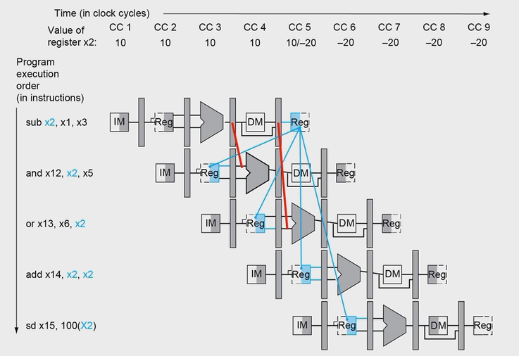
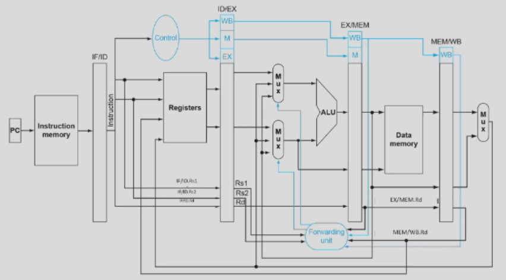

# 第 3 周

## 结构冒险

在一个运算单元正在被占用时，又来一个东西要使用它。比如一条指令的 Instruction fetch 和另一条指令的 Data access 撞车。

怎么解决？直接等？时间代价太大。

像哈佛架构那样，把指令存储器和数据存储器分开？那就要加硬件。不过这也比下面两种冒险的解决方案简单得多了。

## 数据冒险

- 不同的指令之间可能会有数据上的依赖。
- 比如一个指令的操作数是上一个指令的结果。

怎么解决？又是直接等？时间代价还是太大。

或者，直接抢先一步把信号送过来？


但是，这种方案没法应付所有的情况。比如这里。


这里需要暂停一个时钟周期，否则会触发时间悖论。

不过还有一种方法，需要软硬件的协同。

```asm
ld x1, 0(x31)				ld x1, 0(x31)
ld x2, 8(x31)				ld x2, 8(x31)
add x3, x1, x2		  ->	ld x4, 16(x31)
sd x2, 24(x31)		 /		sd x2, 24(x31)
ld x4, 16(x31)		-		add x3, x1, x2
add x5, x1, x4				add x5, x1, x4
sd x5, 32(x31)				sd x5, 32(x31)
```

### 前递技术，抢先一步

```asm
sub x2, x1, x3
and x12, x2, x5
or x13, x6, x2
add x14, x2, x2
sd x15, 100(x2)
```

上面那一些东西有哪些地方发生了数据冒险？



所以说，在把东西放到 ALU 之前，你现在要多判断一些东西：

- 有没有发生数据冒险，要不要来个前递？
- 前递的值本来来自 ID/EX，现在还可能来自以前的 EX/MEM 和 MEM/WB。作为 rs1 还是 rs2？


### 双份的数据冒险

```asm
add x1, x1, x2
add x1, x1, x3
add x1, x1, x4
```

当同时有两个数据冒险出现的时候，那么对于某条指令，它使用的数据当然是来自离它时间上更近的那个。


### 和 load 相关的数据冒险


也就是

- ID/EX.MemRead 是 1
- 并且 ID/EX.Rd = IF/ID.Rs1 或者 IF/ID.Rs2

## 控制冒险

不同的指令之间可能指令的控制流上的依赖，比如 RISC-V 的 B 型指令需要的那些符号位。


一种方法是等；另一种方法是预测。


## 流水线的实施

