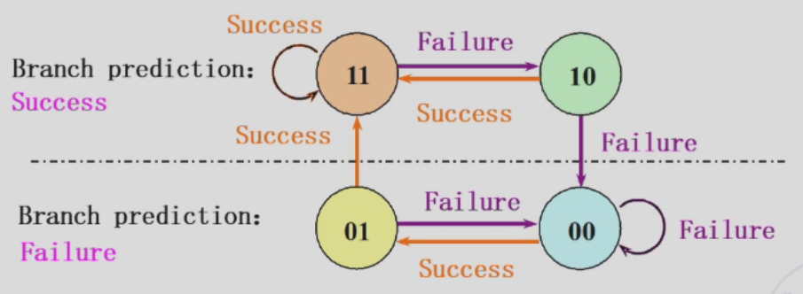

# 第 5 周

## 循环预测器

在之前我们已经说过了关于 b 型指令的一大堆事情。在实现的时候，我们可以假设它成功或者是失败。

不过，不管是总假设为成功还是总假设为失败，都是在蒙。有没有一种可能，让我们可以“聪明一点地”预测？

### 一位的预测器

用一位来记录上次跳转的结果。如果上一次成功，那么这一次也假设成功；如果上一次失败，那么这一次也假设失败。

但是这样会被 hack：

```asm
outer:
inner:
beq ..., inner
beq ..., outer
```

会连续失败两次。那么我们不如……

### 两位的预测器



## 非线性流水线