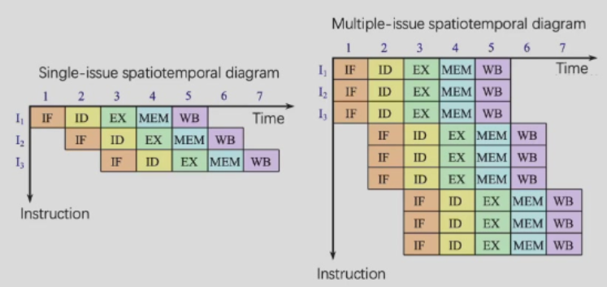
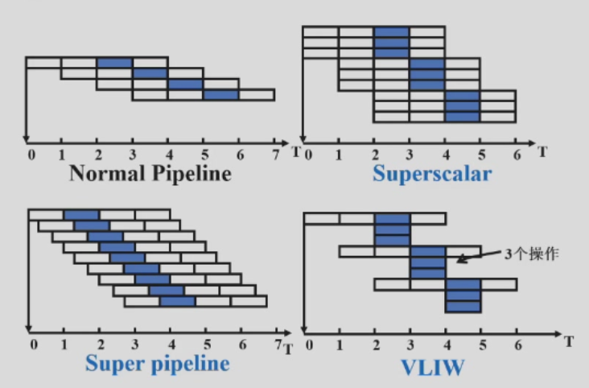
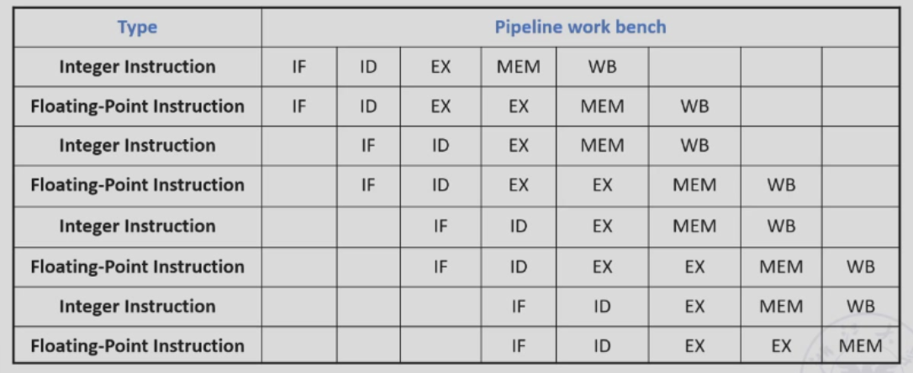
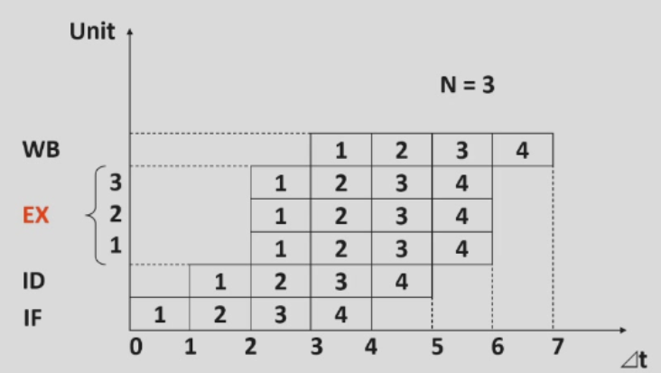

# 第 5 周

## 循环预测器

在之前我们已经说过了关于 b 型指令的一大堆事情。在实现的时候，我们可以假设它成功或者是失败。

不过，不管是总假设为成功还是总假设为失败，都是在蒙。有没有一种可能，让我们可以“聪明一点地”预测？

### 一位的预测器

用一位来记录上次跳转的结果。如果上一次成功，那么这一次也假设成功；如果上一次失败，那么这一次也假设失败。

但是这样会被 hack：

```asm
outer:
inner:
beq ..., inner
beq ..., outer
```

会连续失败两次。那么我们不如……

### 两位的预测器


## 多发射处理器



也就是同一个时刻会发射出多条指令。

问题来了，我们在流水线处理器中所经历的那些冒险……在这里就会更加严重。

### 静态多发射

编译器会把那些互相不冲突的指令放在同一个“发射槽”里面，以规避各种问题。

### 动态多发射

CPU 自己会分析指令流，然后在每一个时钟周期中选择那些合适的指令。

编译器可以预先排列指令来帮助 CPU，不过最终还是让 CPU 在运行时自己做选择。

### 猜测 Speculation

对于某个指令，尽量早地开始对它的执行。在之后，得检查自己的预测正不正确，如果不正确的话就要把已经进入后面部件的指令清理掉。

### 超标量 Superscalar

一个时刻内同时发射出来的指令的条数是不确定的，不过有上限。上限为 n 的处理器就叫做 n 发射处理器。

只搞软件的程序员们一般来说不会注意到它的存在，因为选择哪些指令来并行处理是由处理器自己处理的。

目前来说，这种方法对于通用计算来说是最有效的。

### 超长指令字（Very Long Instruction Word，VLIW）

一个时刻内同时发射出来的指令的条数是确定的，而这些指令会被一并压进一个指令字里面。比如 32 位指令的 CPU 要做 4 发射，那么指令字就会变成 128 位。

至于选哪些指令字去压……这里是让编译器来处理。这有些时候会导致一些兼容性的问题。

所以这种方法一般用在数字信号处理和多媒体的处理。



*什么大叠*

## 静态安排的超标量多发射科技

这大概可以分成两个阶段：

- 首先，检测在将要发射的那些指令里有没有什么冲突。先要把那些一开始就能执行的指令拿出来。
- 然后还要看看这些被选中的指令是否和正在执行的指令有冲突。

RISC-V 是这样实现超标量的：

- 每个时钟周期里面可以放两条指令，一条整型指令，一条浮点型指令。
	- load、store 和 branch 算整型指令。
- 于是这样就有两条 32 位的指令。
	- 首先从内存里面把它们取出来。
	- 然后看一下有哪些可以立即被执行（可能有 0 到 2 条）。
	- 把它们发到相应的处理部分上。
- 另外，浮点型指令被认为是“附加的指令”，它们的 EX 阶段有 2 个时钟周期。



可以预见，这样的话，在原先的流水线处理器上要添加的硬件并不算很多。

## VLIW 科技

编译器会把那些指令打包成一个一个一个指令包。

