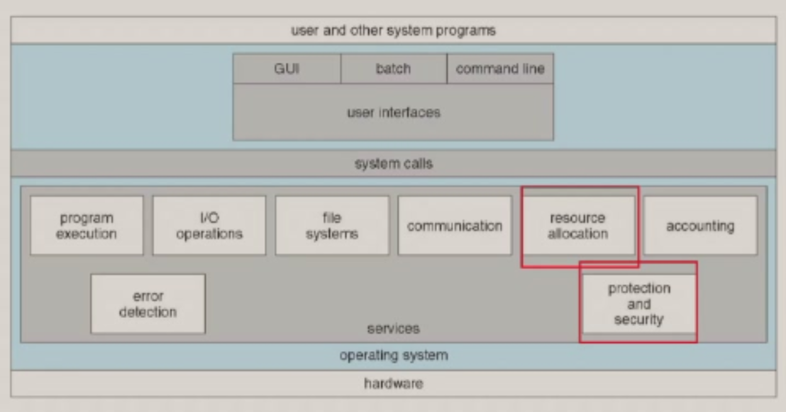
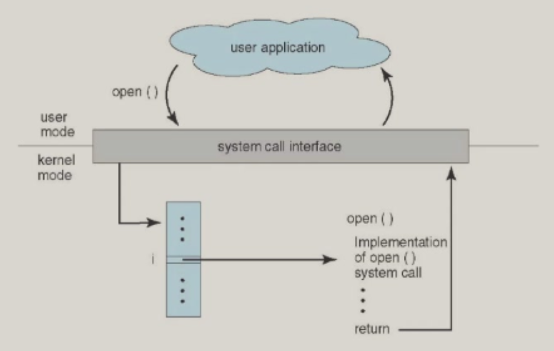

# 第 8 周

## 虚拟化

为了让物理意义上的资源更容易使用，操作系统会把它们变成虚拟的形式。

相应的，如果程序需要使用这些资源，那么操作系统要负责让它和物理意义上的资源之间进行友好的交流。

## 操作系统的服务和结构



### 系统调用

系统调用是编程接口上使用操作系统服务的方法。

它们一般使用 C 或者 C++ 这样的比较高等级的语言写成，部分使用汇编语言实现（因为快）。

比如：

```shell
cp in.txt out.txt
```

```plain
Acquire input file name
	Write prompt to screen
	Accept input
Acquire output file name
	Write prompt to screen
	Accept input
Open the input file
	if file doesn't exist, abort
Open the output file
	if file exists, abort
Loop:
	Read from input file
	Write to output file
Until read fails
Close output file
Write message to screen
Terminate normally
```

### API

那些系统调用，为了兼容性，一般都会被封装成 API。比如 Windows 的 Win32 API、POSIX 和类 POSIX 系统的 POSIX API 和 Java 虚拟机（JVM）的 Java API。

### 系统调用号

一般来说，每个系统调用都有它们自己的一个系统调用号。比如，Linux 有 340 多个系统调用。



### 传递参数

有 3 种方式给系统调用传参。

- 使用寄存器。
- 使用内存的块。
- 使用栈。

很明显，如果使用寄存器的话，那么传参数量就会有限制；另外两种就基本上没有了。

Linux 和 Solaris 使用的是“使用内存的块”方法。

### 在 Linux/x86 里面执行系统调用

```cpp
execve("/bin/sh", 0, 0)
```

其中，eax = 0x0b，ebx = "/bin/sh" 的地址，ecx = 0。

这个过程中，eax 里面会存下系统调用号，然后把参数放在 ebx、ecx、edx……中。（实际上这仍然是“使用内存的块”方法，寄存器里面放的就是内存块的地址。）

之后会执行 int 0x80，返回值放在 eax 里面。
