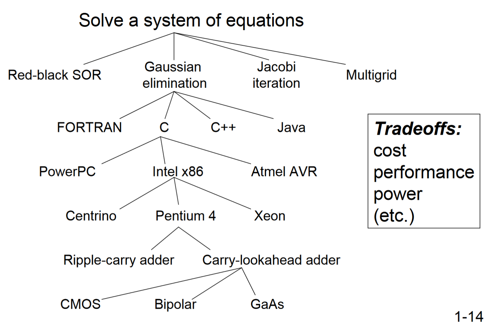
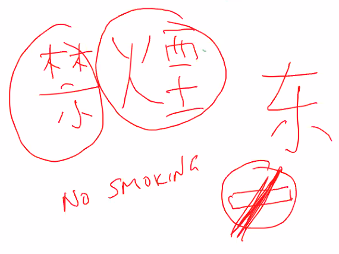

# 第 1 章：欢迎上船

## 计算机到底在干什么？

上过汇编语言的都知道，你用汇编语言写程序的效率和你用 C / C++ / Python 等语言写程序的效率差了一万三千倍。那为什么我们还要上汇编语言呢？

事实上，汇编语言可以让你理解计算机到底是如何你安排给它的任务的，而那些另外的程序语言则不同。

那么，理解计算机到底在干什么，重要吗？

……你说呢。

### 我们都一样

事实上，所有的计算机，只要给足了时间、内存与存储空间，那它们能干的事情是完全一样的。

电脑的处理器可以剪视频，手表的当然也可以；只是手表要跑得慢*一些*罢了。

### 图灵机，通用图灵机

图灵说，所有的运算都可以被某些图灵机所执行。当然，能够执行所有图灵机能执行的指令的图灵机也是图灵机；不过这个图灵机非常牛 B，我们叫它通用图灵机。

比如有两个图灵机，一个算加法：f(a, b) -> a + b，一个算乘法：g(a, b) -> ab。它们的通用图灵机 h(f, g, a, b, c) -> c(a + b) 可以干它们两个的事情。

通用图灵机就是这样一个输入数据和运算方法的机器。这不就是计算机嘛！

### 从理论，到实践

虽然说计算机可以干*任何*事情……但是解决问题是有**限制**的。

- 时间：天气预报、游戏渲染（一帧以内！）……
- 算力：移动设备、汽车发动机控制器……
- 能耗：手机、掌机（Switch、3DS 等）……

## 语言：从我们到计算机

我们有自己的语言。比如汉语、英语、日语……它们是自然语言。

计算机们也有自己的语言。如果把眼光放得最细的话，它们实际上是电子的移动。

很明显的，计算机是听不懂自然语言的。但是我们必须要找到一种方法，向计算机表达自己的目的。

### 算法 Algorithms

计算机认为，自然语言是丑陋的，因为它们有歧义（ambiguity）；模棱两可，不精确。仙布管那些复杂的语法和语境了，单是中文的一词多义就足够搞死计算机了，再加上中文和日文的对某个字不同的意思就真的爆炸了。

> Kali：给这个数列排个序。
>
> 计算机：我该怎么做啊？
>
> Kali：就是从小到大把这些数重新排列一下。
>
> 计算机：我不到啊！！

怎么明确地表达自己的意思呢？使用算法去描述它们。

**算法是按部就班的程序，需要保证确定性（每一步都只有一种执行方式）、可计算性（不能求“最大的质数”之类的）和有限性（不能无限地跑下去）。**

> 
>
> *图：中文真的很难*

### 程序语言 Language

我们有了算法后，可以用某些程序语言描述它们。

程序语言有比较高等的（距离汇编比较远），有比较低等的（距离汇编比较近，或者就是汇编），当然也有通吃的（C++ 什么的）。使用哪种？问我干什么，问你自己。

### 指令集体系结构 Instruction Set Architecture

指令集体系结构（ISA）提供了软件和硬件之间接口的一个完整定义，说明了某台计算机上面到底**可以跑哪些指令（opcode 和 operand），有哪些数据类型（data type），以及在这台计算机上怎么寻址（addressing modes）。**

8086、286、386、486、奔腾……从 1979 年开始，ISA 的标准不断发展。

幸好，大部分家伙都没有丢掉兼容性。

程序语言最终都是要被编译器啊链接器啊汇编器啊什么的翻译成机器语言。机器语言离 ISA 描述的东西很近了。

### 微处理器体系结构 Microarchitecture

微体系结构中有微指令，它们是上面那一层的指令的组成部分。

### 电路 Circuits

上面那一些东西，终究是被各种各样的电路搭起来的。这直接涉及了计算机存在的原理。

*图：好多的选择*

> 
>
> *图：Yale Patt 最喜欢的汉字是“禁烟”*
