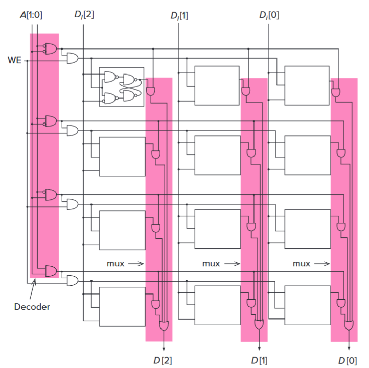

# 第 3 章：数字逻辑结构

## 晶体管：计算机大厦之砖

### MOS 晶体管

MOS 是 MOSFET 的缩写，MOSFET 又是 Metal-Oxide-Semiconductor Field-Effect Transistor 的简写。MOS 晶体管就是金属-氧化物半导体场效应管。

对于 n-type（negative type）MOS 晶体管：门的输入电压高时，门闭合（连通）；门没什么输入电压时，门分开（不连通）。

P-type（positive type）MOS 晶体管和 n-type 的相反。

### CMOS 电路

CMOS：Complementary MOS，互补的 MOS。

CMOS 电路中，有一端高电压，一端接地（电压为 0）。电路连接它们两端，通过门的闭合和分开，将高电压或者接地引向输出。计算机系统 I 里面上过了。

注意 XNOR 是 NOT(XOR())。

> Patt: What do you think of Donald Trump? ...
>
> ...
>
> Patt: In China, the food is very delicious... But I have not eaten that for 3 years.
>
> ?: Do you have any pet like cat?
>
> Patt: No.
>
> ?: What's the temperature in Texas?
>
> Patt: Very hot. Possibly over 100 °F (> 40 °C). But I can tolerate that in China but cannot in Texas, that's strange.
>
> ?: (sweating emoji)
>
> ?: Show show way
>
> Patt: Show show way? I don't knot what's that.
>
> iotang: kusa

## 组合逻辑电路

### 门

逻辑运算：

- 非 NOT
- 与 AND
- 或 OR
- 异或 XOR
- 或非 NOR

组合逻辑电路：

- 解码器 Decoder
- 多路选择器 Mux，以及反向的 Dmux
- 半加器，全加器

## 内存

### 基本的数据储存结构

- R-S Latch
- D Latch, Gated D Latch

### 内存的寻址

*图：一个 4-by-3-bit 内存。它存储 4 组 3 位的数据。*

## 时序逻辑电路