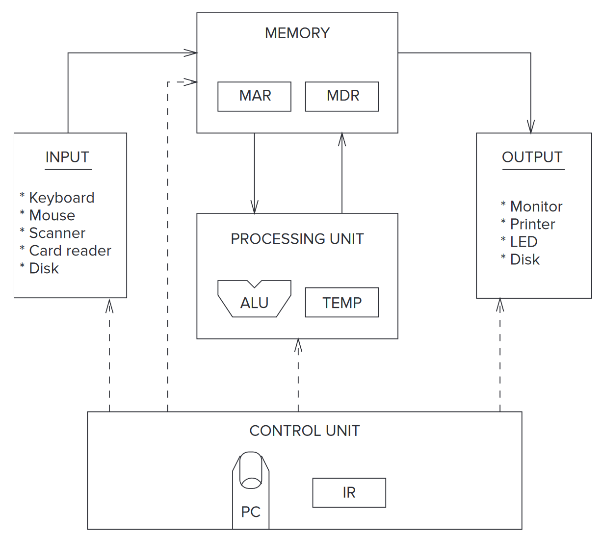

# 第 4 章：冯诺依曼架构

## 基本组成部分

一个冯诺依曼架构的计算机一般由 5 个部分组成：

- 内存
- 计算单元
- 输入
- 输出
- 控制单元



*图：冯诺依曼架构*

### 内存 Memory

16 GB 内存指什么？GB 在这里是 gigabytes，而 16 giga 等于 $2^{34}$，后面的 bytes 代表一个内存单元里面有 8 个位（= 1 个字节）。16 GB 内存就是指这内存中有 $2^{34}$ 个字节。

#### 内存的读写

内存有它的两个寄存器，一个是关于地址的（MAR），一个是关于值的（MDR）。

当要读某个地方的内存值的时候，就往 MAR 里面写数据，然后给内存一个控制信号，让它把对应地方的值写进 MDR 里。

而要写某个地方的内存值的时候，就往 MAR 和 MDR 里面都写数据，然后给内存一个控制信号，让它把对应地方的值给改了就好了。

### 计算单元 Processing Unit

有个重量级的东西，叫做 Arithmetic and Logic Unit（ALU）。它可以执行一些操作，比如求两个值的和，以及取 AND、OR、NOT 什么的。

ALU 一般接收的用来运算的数都是定长的。这个长度叫做计算机的字长（word length）。比如现在的 CPU 基本上都是 64 位的字长了；8 位或者 16 位字长一般可以在非常廉价的处理器中看到。

### 输入、输出

可以说是计算机的外设来完成了输入输出，比如键盘、鼠标提供输入，而显示器什么的提供输出。

### 控制单元

它解析机器语言，向上面的所有东西发号施令。

它拥有一个储存机器码指令的寄存器 IR（instruction register）；以及一个存储下一条指令的位置的寄存器，这个寄存器由于一些历史原因会被叫做 program counter（PC），不过它有个更好的名字叫 instruction pointer（IP）。

## LC-3 是一种冯诺依曼计算机


*图：LC-3 的数据通路*

### 内存 MEMORY

拥有 $2^{16}$ 个内存地址，每个地址有 16 位长。

它也有一个 MAR 和一个 MDR。

### 输入输出 INPUT / OUTPUT

输入部分由一个键盘负责。它也有两个寄存器：键盘数据寄存器 KBDR，存着现在被按下去的键的 ASCII 码；以及键盘状态寄存器 KBSR，存着像 ++ctrl++、++alt++、++shift++ 等键什么的有没有被按下去。

### 计算单元 THE PROCESSING UNIT

里面有一个 ALU 和 8 个寄存器 R0 到 R7。LC-3 的 ALU 可以干加法、取 AND 和取 NOT。这么少？

### 控制单元 THE CONTROL UNIT

拥有一个 IR 和一个 PC。

## LC-3 的指令处理

LC-3 的操作由两部分组成，opcode（类似于函数名）和 operands（类似于参数）。

因为 LC-3 是个 16 位机器，它的指令长度也都是 16 位的。

### ADD

两个寄存器相加：`ADD DR, SR1, SR2`

- [15:12] ADD：0001
- [11:9] DR：存入的寄存器编号
- [8:6] SR1：参与运算的寄存器 1 编号
- [5] 标识符：0
- [4:3] 未使用：00
- [2:0] SR2：参与运算的寄存器 2 编号

一个寄存器和一个立即数相加：`ADD DR, SR1, imm5`

- [15:12] ADD：0001
- [11:9] DR：存入的寄存器编号
- [8:6] SR1：参与运算的寄存器 1 编号
- [5] 标识符：1
- [4:0] imm5：立即数

```cpp
if (bit[5] == 0)
	DR = SR1 + SR2;
else
	DR = SR1 + SEXT(imm5);
setcc();
```

### AND

两个寄存器取与：`AND DR, SR1, SR2`

- [15:12] AND：0101
- [11:9] DR：存入的寄存器编号
- [8:6] SR1：参与运算的寄存器 1 编号
- [5] 标识符：0
- [4:3] 未使用：00
- [2:0] SR2：参与运算的寄存器 2 编号

一个寄存器和一个立即数取与：`AND DR, SR1, imm5`

- [15:12] AND：0101
- [11:9] DR：存入的寄存器编号
- [8:6] SR1：参与运算的寄存器 1 编号
- [5] 标识符：1
- [4:0] imm5：立即数

```cpp
if (bit[5] == 0)
	DR = SR1 AND SR2;
else
	DR = SR1 AND SEXT(imm5);
setcc();
```

### NOT

把一个寄存器取反：`NOT DR, SR`

- [15:12] NOT：1001
- [11:9] DR：存入的寄存器编号
- [8:6] SR：参与运算的寄存器编号
- [5:0] 未使用：111111

```cpp
DR = NOT(SR);
setcc();
```

### LD

LD 在这里是 load 的意思。

`LD DR, LABEL`

- [15:12] LD：0010
- [11:9] DR：存入的寄存器编号
- [8:0] PCoffset9：立即数

LD 使用的是 PC+offset 的寻址方式。即会去拿 PC（已经指向下一步的 PC）和立即数相加，然后得到的数当作内存下标去寻址。

```cpp
if (computed address is in privileged memory AND PSR[15] == 1)
	Initiate ACV exception;
else
	DR = mem[nextPC + SEXT(PCoffset9)];
	setcc();
```

### LDI

`LDI SR, LABEL`

- [15:12] LDI：1010
- [11:9] DR：存入的寄存器编号
- [8:0] PCoffset9：立即数

```cpp
if (either computed address is in privileged memory AND PSR[15] == 1)
	Initiate ACV exception;
else
	DR = mem[mem[nextPC + SEXT(PCoffset9)]];
	setcc();
```

### LDR

`LDR DR, BaseR, offset6`

- [15:12] LDR：0110
- [11:9] DR：存入的寄存器编号
- [8:6] BaseR：拿来定位的寄存器编号
- [5:0] offset6：立即数

```cpp
if (computed address is in privileged memory AND PSR[15] == 1)
	Initiate ACV exception;
else
	DR = mem[BaseR + SEXT(offset6)];
	setcc();
```

### ST

就是 Store，储存。

`ST SR, LABEL`

- [15:12] ST：0011
- [11:9] SR：要存入的寄存器编号
- [8:0] PCoffset9：立即数

ST 使用的是 PC+offset 的寻址方式。即会去拿 PC（已经指向下一步的 PC）和立即数相加，然后当作内存下标去把寄存器的值存下来。

```cpp
if (computed address is in privileged memory AND PSR[15] == 1)
	Initiate ACV exception;
else
	mem[nextPC + SEXT(PCoffset9)] = SR;
```

### STI

`STI SR, LABEL`

- [15:12] STI：1011
- [11:9] SR：要存入的寄存器编号
- [8:0] PCoffset9：立即数

```cpp
if (either computed address is in privileged memory AND PSR[15] == 1)
	Initiate ACV exception;
else
	mem[mem[nextPC + SEXT(PCoffset9)]] = SR;
```

### STR

`LDR DR, BaseR, offset6`

- [15:12] LDR：0111
- [11:9] SR：要存入的寄存器编号
- [8:6] BaseR：拿来定位的寄存器编号
- [5:0] offset6：立即数

```cpp
if (computed address is in privileged memory AND PSR[15] == 1)
	Initiate ACV exception;
else
	mem[BaseR + SEXT(offset6)] = SR;
```

### BR

就是 Branch。

`BR / BRn / BRz / BRp / BRnz / BRnp / BRzp / BRnzp LABEL`

- [15:12] BR：0000
- [11] n：小于 0
- [10] z：等于 0
- [9] p：大于 0
- [8:0] PCoffset9：立即数

```cpp
if ((n AND N) OR (z AND Z) OR (p AND P))
	PC = nextPC + SEXT(PCoffset9);
```

### TRAP

自陷指令，和中断差不多。

- [15:12] TRAP：1111
- [11:8] 未使用：0000
- [7:0] trapvect8：自陷向量

```cpp
TEMP=PSR;
if (PSR[15] == 1)
	Saved USP=R6 and R6=Saved SSP;
	PSR[15]=0;
Push TEMP, nextPC on the system stack
PC = mem[ZEXT(trapvect8)];
```

其中 trapvect8 = x25 是 HALT。

## 指令周期

可以分为六步：

- 获得数据 FETCH
- 解码 DECODE
- 分析地址 EVALUATE ADDRESS
- 获取操作数 FETCH OPERANDS
- 执行 EXECUTE
- 存储结果 STORE RESULT

### 获得数据 FETCH

这一步将这一次的指令存到 IR 中。

- MAR 的值变成了 PC，然后把 PC 增加。
- 内存收到指令，把 MAR 对应地方的值放到 MDR 中。
- IR 的值变成了 MDR。

### 解码 DECODE

通过喂给解码器 IR 的 [15:12] 位（opcode），它可以确定到底要执行哪一种指令。（所以说LC-3 最多有 16 种指令。）

### 分析地址 EVALUATE ADDRESS

比如说 LD 指令这样的需要从内存中加载值的指令，有些指令需要动用内存。这一步会计算将要读取的内存的地址。

### 获取操作数 FETCH OPERANDS

这一步会把指令所需要的操作数准备好。比如在 ADD 中，这一步就会把所需要的两个寄存器的值（或者一个寄存器和一个立即数）发送到 ALU 中。

### 执行 EXECUTE

一切都准备好之后，就要开始计算了。

### 存储结果 STORE RESULT

这一步会往应该的地方存储结果，如果有结果的话。
