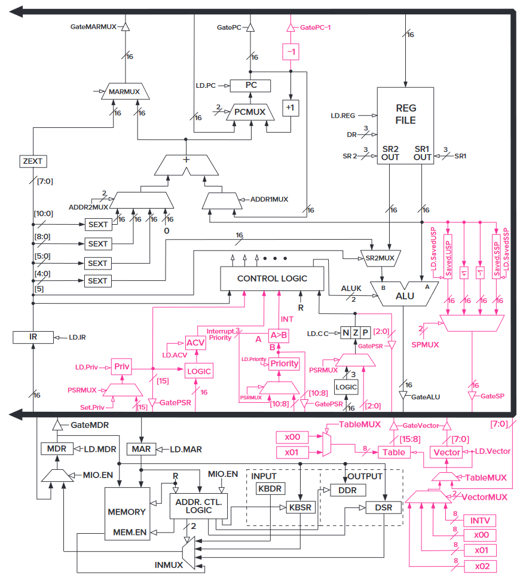

# 第 5 章：LC-3

## LC-3 的 ISA

### 内存的组织 Memory Organization

LC-3 的内存中有 $2^{16}$ 个 16 位的空间。或者说，内存空间是 $2^{16}$，写入能力（addressability）是 16。

对于它，我们认为一个字（word）长度就是 16 位。那么 LC-3 就是一个按字编址（word-addressable）的家伙了。

### 寄存器 Register

LC-3 里面有很多种寄存器，而我们常用的是那一些通用寄存器（general purpose register，GPR）。它一共有 8 个，名字叫 R0 到 R7，可以存储一个字（16 位）。

### 指令集和操作码 Instruction Set and Opcode

LC-3 的指令集是单周期的，长度也是一个字（16 位）。

留给 opcode 的位数只有 4，也就是说最多有 16 种指令（确切来说，有 15 种）。有什么影响？你等会就知道了。

### 寻址类型 Addressing Modes

LC-3 支持三种寻址类型：PC 相关（PC-relative）、间接寻址（indirect）和 Base+offset。

草，没有直接跳转的吗。那只能让汇编器它自己转义了。

### 状态码 Condition Codes

LC-3 有三个长度为 1 位的状态码，分别叫做 N、Z 和 P。

猜到了？就是记录刚刚那条指令的运算结果是不是负的（negative），是不是 0（zero），以及是不是正的（positive）。

## LC-3 的指令

LC-3 的操作由两部分组成，opcode（类似于函数名）和 operands（类似于参数）。

因为 LC-3 是个 16 位机器，它的指令长度也都是 16 位的。

（写 LC-3 的汇编时，以数字前面加 `#` 来声明这是个十进制数，前面加 `x` 来声明是一个 16 进制数，前面加 `b` 来声明是一个二进制数。默认是十进制数。）

### ADD

两个寄存器相加：`ADD DR, SR1, SR2`

- [15:12] ADD：0001
- [11:9] DR：存入的寄存器编号
- [8:6] SR1：参与运算的寄存器 1 编号
- [5] 标识符：0
- [4:3] 未使用：00
- [2:0] SR2：参与运算的寄存器 2 编号

一个寄存器和一个立即数相加：`ADD DR, SR1, imm5`

- [15:12] ADD：0001
- [11:9] DR：存入的寄存器编号
- [8:6] SR1：参与运算的寄存器 1 编号
- [5] 标识符：1
- [4:0] imm5：立即数

```cpp
if (bit[5] == 0)
	DR = SR1 + SR2;
else
	DR = SR1 + SEXT(imm5);
setcc();
```

这个指令会根据运算结果改变状态码。

### AND

两个寄存器取与：`AND DR, SR1, SR2`

- [15:12] AND：0101
- [11:9] DR：存入的寄存器编号
- [8:6] SR1：参与运算的寄存器 1 编号
- [5] 标识符：0
- [4:3] 未使用：00
- [2:0] SR2：参与运算的寄存器 2 编号

一个寄存器和一个立即数取与：`AND DR, SR1, imm5`

- [15:12] AND：0101
- [11:9] DR：存入的寄存器编号
- [8:6] SR1：参与运算的寄存器 1 编号
- [5] 标识符：1
- [4:0] imm5：立即数

```cpp
if (bit[5] == 0)
	DR = SR1 AND SR2;
else
	DR = SR1 AND SEXT(imm5);
setcc();
```

这个指令会根据运算结果改变状态码。

### NOT

把一个寄存器取反：`NOT DR, SR`

- [15:12] NOT：1001
- [11:9] DR：存入的寄存器编号
- [8:6] SR：参与运算的寄存器编号
- [5:0] 未使用：111111

```cpp
DR = NOT(SR);
setcc();
```

这个指令会根据运算结果改变状态码。

### LEA

把一个标号所在的地址扔给一个寄存器。

`LEA DR, LABEL`

- [15:12] LEA：1110
- [11:9] DR：存入的寄存器编号
- [8:0] PCoffset9：立即数

```cpp
DR = nextPC + SEXT(PCoffset9);
```

### LD

LD 在这里是 load 的意思。

`LD DR, LABEL`

- [15:12] LD：0010
- [11:9] DR：存入的寄存器编号
- [8:0] PCoffset9：立即数

LD 使用的是 PC + offset 的寻址方式。即会去拿 PC（已经指向下一步的 PC）和立即数相加，然后得到的数当作内存下标去寻址。

```cpp
if (computed address is in privileged memory AND PSR[15] == 1)
	Initiate ACV exception;
else
	DR = mem[nextPC + SEXT(PCoffset9)];
	setcc();
```

这个指令会根据读取到的值改变状态码。

### LDI

`LDI SR, LABEL`

- [15:12] LDI：1010
- [11:9] DR：存入的寄存器编号
- [8:0] PCoffset9：立即数

LDI 使用的是间接寻址的方式。

```cpp
if (either computed address is in privileged memory AND PSR[15] == 1)
	Initiate ACV exception;
else
	DR = mem[mem[nextPC + SEXT(PCoffset9)]];
	setcc();
```

这个指令会根据读取到的值改变状态码。

### LDR

`LDR DR, BaseR, offset6`

- [15:12] LDR：0110
- [11:9] DR：存入的寄存器编号
- [8:6] BaseR：拿来定位的寄存器编号
- [5:0] offset6：立即数

LDR 使用的是 Base + offset 的方式。

```cpp
if (computed address is in privileged memory AND PSR[15] == 1)
	Initiate ACV exception;
else
	DR = mem[BaseR + SEXT(offset6)];
	setcc();
```

这个指令会根据读取到的值改变状态码。

### ST

就是 Store，储存。

`ST SR, LABEL`

- [15:12] ST：0011
- [11:9] SR：要存入的寄存器编号
- [8:0] PCoffset9：立即数

ST 使用的是 PC+offset 的寻址方式。即会去拿 PC（已经指向下一步的 PC）和立即数相加，然后当作内存下标去把寄存器的值存下来。

```cpp
if (computed address is in privileged memory AND PSR[15] == 1)
	Initiate ACV exception;
else
	mem[nextPC + SEXT(PCoffset9)] = SR;
```

### STI

`STI SR, LABEL`

- [15:12] STI：1011
- [11:9] SR：要存入的寄存器编号
- [8:0] PCoffset9：立即数

STI 采用的是间接寻址的方式。

```cpp
if (either computed address is in privileged memory AND PSR[15] == 1)
	Initiate ACV exception;
else
	mem[mem[nextPC + SEXT(PCoffset9)]] = SR;
```

### STR

`LDR DR, BaseR, offset6`

- [15:12] LDR：0111
- [11:9] SR：要存入的寄存器编号
- [8:6] BaseR：拿来定位的寄存器编号
- [5:0] offset6：立即数

STR 使用的是 Base + offset 的方式。

```cpp
if (computed address is in privileged memory AND PSR[15] == 1)
	Initiate ACV exception;
else
	mem[BaseR + SEXT(offset6)] = SR;
```

### BR

就是 Branch。

`BR / BRn / BRz / BRp / BRnz / BRnp / BRzp / BRnzp LABEL`：

- [15:12] BR：0000
- [11] n：小于 0
- [10] z：等于 0
- [9] p：大于 0
- [8:0] PCoffset9：立即数

`BR` 也是无条件跳转。

```cpp
if ((n AND N) OR (z AND Z) OR (p AND P))
	PC = nextPC + SEXT(PCoffset9);
```

### JMP，RET

`JMP BaseR`

- [15:12] RET：1100
- [11:9] 未使用：000
- [8:6] 存储了要跳转的位置的寄存器编号：BaseR
- [5:0] 未使用：000000

```cpp
PC = BaseR;
```

`RET` 就是 `JMP R7`。

- [15:12] RET：1100
- [11:9] 未使用：000
- [8:6] 存储了要跳转的位置的寄存器编号：BaseR：111
- [5:0] 未使用：000000

```cpp
PC = R7;
```

### JSR，JSRR

`JSR LABEL`：

- [15:12] JSR：0100
- [11] JSR 标志：1
- [10:0] PCoffset11

```cpp
TEMP = nextPC;
PC = nextPC + SEXT(PCoffset11);
R7 = TEMP;
```

`JSRR BaseR`：

- [15:12] JSRR：0100（和 JSR 共用。靠下面那个值区分）
- [11] JSRR 标志：0
- [10:9] 未使用：00
- [8:6] 存储了要跳转的位置的寄存器编号：BaseR
- [5:0] 未使用：000000

```cpp
TEMP = nextPC;
PC = BaseR;
R7 = TEMP;
```

### TRAP

自陷指令，和中断差不多。

- [15:12] TRAP：1111
- [11:8] 未使用：0000
- [7:0] trapvect8：自陷向量

```cpp
TEMP=PSR;
if (PSR[15] == 1)
	Saved USP=R6 and R6=Saved SSP;
	PSR[15]=0;
Push TEMP, nextPC on the system stack
PC = mem[ZEXT(trapvect8)];
```

其中 trapvect8 = x25 是 HALT。

### RTI

- [15:12] RTI：1000
- [11:0] 未使用：000000000000

```cpp
if (PSR[15] == 1)
	Initiate a privilege mode exception;
else
	PC = mem[R6]; R6 is the SSP, PC is restored
	R6 = R6+1;
	TEMP = mem[R6];
	R6 = R6+1; system stack completes POP before saved PSR is restored
	PSR = TEMP; PSR is restored
	if (PSR[15] == 1)
		Saved SSP=R6 and R6=Saved USP;
```

栈上的头两个值会弹出，第一个给 PC，第二个给 PSR。

注意是在给 PSR 复制之前就把第二个给弹出了。

## 缺少的指令

没有乘法，没有减法……不会吧，连取反都没有？

别急，你可以发现连 OR 都没有！

所以说只能德摩根一下了……`A OR B = NOT(NOT(A) AND NOT(B))`……

减法就是加相反数……相反数就是按位取非加 1……真他妈的能省则省啊。

至于乘法除法，你还能怎么办呢……LC-3！你睡了吗！我-睡-不-着——！

## LC-3 的数据通路



*图：LC-3 的数据通路*

### 全局总线 Global Bus

那条又粗又黑的线就是全局总线。这根总线里面有 16 根线，也就是说它可以让 LC-3 里面的两个结构之间传递最多 16 位的信息。

在同一时间点上，最多只能有一个值是在这里面传输的。为了确保这一点，“三态门”（上面的那张图上的小三角形）们控制着数据的流向。（“三态”中，两个状态是传输时的 0 和 1，一个是切断的时候。）

### 内存 Memory

它有一个 MAR 和一个 MDR，用来控制内存的读写。至于什么时候读写呢？有个信号叫 WE（write enable），当它出现的时候，就是内存要把 MAR 的位置的数据写进 MDR 的时候了。

### ALU 和寄存器文件 ALU and the Register File

寄存器文件中有 8 个寄存器 R0 到 R7。它们这一坨在一次读取命令下来后可以一次给出最多两个数值，一个在 SR1 里面，一个在 SR2 里面。

ALU 接受两个输入（不算控制信号）。它的运算结果会写进一个寄存器中（丢不掉），同时它还会改变存在 LOGIC 里面的 NZP 三个状态码。

### PC 和 PCMUX

PC 向 MAR 传递信息，找内存要指定地方的指令。而 PCMUX 决定了 PC 的值来自哪里。它有三个输入，一个来自总线，一个来自各种跳转计算出来的位置，一个来自 PC + 1。

### MARMUX

它决定了 MAR 的值来自哪里，是 PC 还是某个寄存器。

## LC-3 的指令周期

### FETCH

PC 寄存器会把自己的值写进 MAR 里面，然后自己写进去自己的增量。

在下一个时钟周期时，内存把 MAR 的位置对应的值写进 MDR。

又过了一个时钟周期后，IR 寄存器从 MDR 里面拿值过来。

### DECODE

在之后的那个时钟周期，IR 里面的内容会被翻译成一堆控制信号，针对 LC-3 的方方面面。

### EVALUATE ADDRESS

如果要从内存中读取数据放到寄存器中，那么接下来就会计算地址，并且通过 MARMUX 把地址放到 MAR 里面。

### OPERAND FETCH

指令说需要的数据会全部准备好。这可能需要等好几个时钟周期。

### EXECUTE

执行指令所需要干的事情。

### STORE RESULT

如果有结果的话，把结果放到正确的位置。