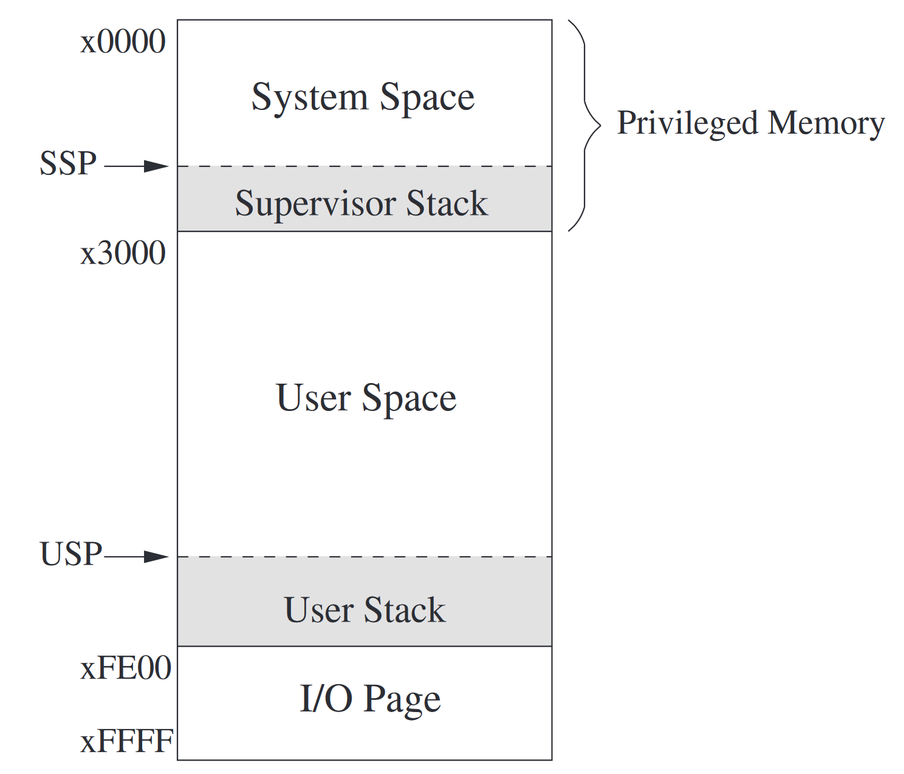
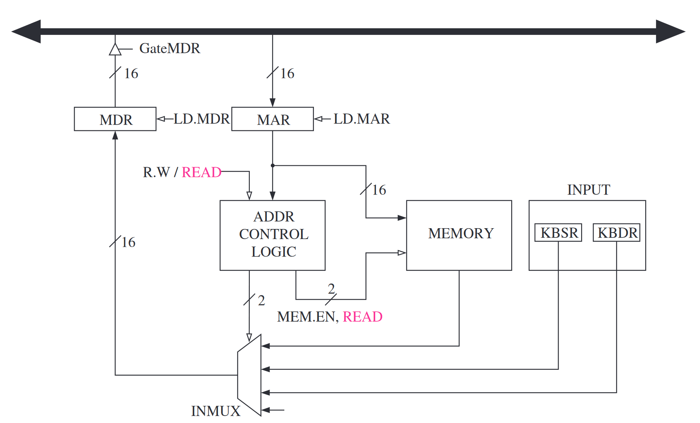
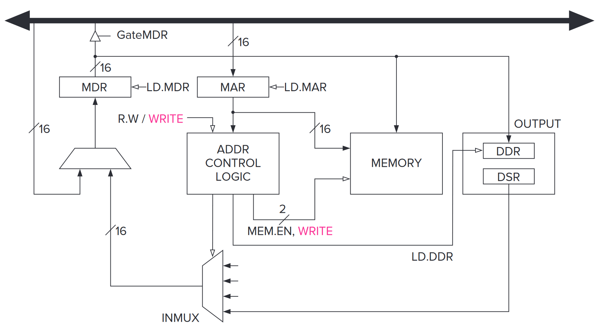
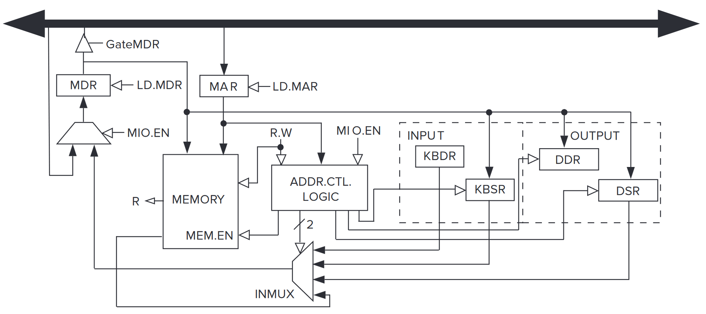
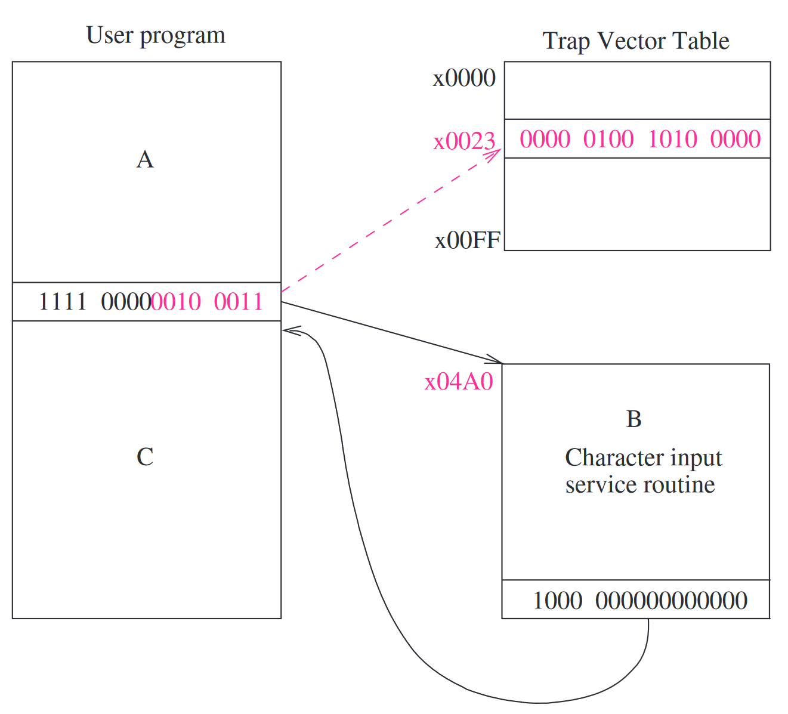

# 第 9 章：输入输出

## 权限与优先级

### 权限

很明显，并不是所有的程序都拥有运行任意指令的权限。比如一旦你放开了指令 HALT 的使用，那么随便一个人都可以让电脑关机；如果你放开了某些内存地址的读写权限，那么随便来个家伙都可以让系统当场爆炸。

既然如此，我们需要设计“权限”这个东西。在 LC-3 中，权限管理非常简单：就分为“有特权”和“没有特权”。一般来说，有特权的程序被称为“运行在管理员模式（Supervisor Mode）下”，或者说拥有管理员权限，没有特权的程序被称为“运行在用户模式（User Mode）下”，或者说只拥有用户权限。

管理员模式下的程序有读写执行任意内存的能力。

### 优先级

这里指的是程序运行的优先级。是的，程序在这里是不平等的。比如说你瞎 jb 写的程序拥有强度 0 的优先级，关于键盘输入的程序拥有强度 4 的优先级，而……如果可以这么理解的话，电源拥有强度无限大的优先级，因为毕竟如果你拔线了，那电脑上的所有程序都连着你一起爆炸了……或者说，赶紧运行一个*强度无限大的程序*以最小化损失？

### 处理器状态寄存器 Processor Status Register

处理器状态寄存器（Processor Status Register，PSR）又是一个 16 位长的寄存器。

- [15]：Pr：Priv
- [10:8]：PL n：Priority
- [2]：N：状态码
- [1]：Z：状态码
- [0]：P：状态码

## 内存的组织

LC-3 是个 16 位机器，而它的寻址空间自然最多也是 x0000 到 xffff。

其中，x0000 到 x2fff 是权限内存（Privileged Memory），其中包含的是操作系统的程序、数据结构，以及一些不能动的东西。只有管理员模式下的程序才能动它们。这一块区域又叫做系统空间（system space）。

而 x3000 到 xfdff 是非权限内存，存储用户的程序和数据。而这块区域就叫做用户空间（user space）。

那 xfe00 到 xffff 是啥子呢？事实上，它们不是“内存”。也就是说内存区域到 xfdff 就打止了。这些地方存储的是输入输出函数，以及和处理器有关的一些寄存器。比如 PSR 就是 xfffc，而处理器的主控寄存器（Master Control Register，MCR）就是 xfffe。很明显，访问这些区域也需要管理员权限。

内存中有两个栈，系统空间里面有一个，用户空间里面也有一个。一个给操作系统用，需要管理员权限；一个给用户用，不需要管理员权限。系统空间的栈的栈指针叫 Supervisor Stack Pointer（SSP），而用户空间的叫 User Stack Pointer，各自指向自己栈的栈顶。

那栈指针 r6 存的是谁呢？因为一个程序要不运行在管理员模式下，要不运行在用户模式下，也就是说这两个栈不会同时被使用。栈指针 r6 存的就是正在使用的那个栈，而没在用的栈指针有两个寄存器，Saved_SSP 和 Saved_USP 专门存下来。



*图：LC-3 的内存区域*

## 输入，输出

输入输出设备，像键盘啊，显示器啊，硬盘啊什么的，使用寄存器来进行输入输出。一般来说，即使是最简陋的输入输出设备，也至少需要两个寄存器：一个存数据，一个存状态。

### 映射到内存，还是用特殊指令

很久以前，计算机们对于数据的输入和输出分为两派。一派是拿一些特殊指令来执行输入和输出，另一派是把输入和输出映射到内存，然后用各种数据传递的指令来进行输入和输出。LC-3 使用的是后一种。对，就是 xfe00 到 xffff 的那一堆东西。

### 异步，还是同步

大部分输入输出设备的速度都是赶不上处理器的。比如说键盘，你叫顺风下速度 +6 的雷吉艾勒奇过来打字，他相比处理器的速度来说都差了十万八千里——即使是主频只有 2 GHz 的处理器，一个时钟周期都只有 0.5 纳秒！纵使你说输入输出可能需要好多个时钟周期，但是即使是要一万三千个时钟周期，那也只有几毫秒长，这不还是赶不上。

既然如此，我们可不可以让键盘以*慢一些的*时钟频率，均匀地接收信号呢？到底要多慢呢？太快了的话有些浪费性能，太慢的话你永远也不知道像速录员啊音游玩家啊的手速到底有多快。

问题出在哪里呢？因为输入输出设备的工作风格和处理器不同——速度不同，均匀性也不同。我们把输入输出设备的这种风格叫做异步（asynchronous），不是伊布。反义词就是同步（synchronous）。大多数输入输出设备和处理器之间的交互都是异步的。

怎么处理异步呢？这需要它们之间的一些“握手”（handshaking）的机制。比如说键盘，它为此有一个寄存器，记录键盘上面有没有键被按下去。又比如说显示器，它也可以拿个寄存器告诉处理器说它是否已经完成当前内容的显示。这些寄存器就叫做 flag。

这些 flag 是让它们之间同步（synchronization）的最简单的形式。拿上面的键盘做例子，键盘上面有键的话就把 flag 设为 1；而处理器发现 flag 为 1 的时候就会拿走数据，并且把 flag 设成 0，告诉键盘，啊，刚刚那个键已经被拿走了。

不过也有输入输出设备本来就和处理器是同步的。比如说有个发臭的打点计时器，每隔 114514 个时钟周期就会咆哮一下。那么上文中的 flag 就不必要了。这个时候，它们两个被叫做“同步（synchronously）”地运行。

### 中断，还是轮询

中断和轮询的区别在于，交互的起手是由谁控制的。

比如说雷吉艾勒奇在打字。当他按下一个键的时候，键盘信号就一下子冲过来然后拦住了处理器说，啊，我这边有个键被按下去了，你赶紧读一下！处理器被它这么一中断，就只好把键盘内容给读了再继续自己的工作。这个就叫做中断。

还是雷吉艾勒奇在打字。当他按下一个键的时候，键盘的 flag 被设成 1。但它并没有中断处理器，而是处理器每隔一段时间来看看 flag 的值，如果是 1 的话就把键盘的值拿走，看看发生了什么。这个就叫做轮询。

## 键盘的输入

### 寄存器 KBDR 和 KBSR

键盘数据寄存器（keyboard data register，KBDR）在 xfe02 的位置，而键盘状态寄存器（keyboard status register，KBSR）在 xfe00 的位置。

KBDR 只有 [7:0] 位是有值的，因为 ASCII 码也就 256 个，其它地方都是 0；KBSR 就更过分了，只有 [15] 这一位是有值的。但是对于 LC-3 来说，16 位 16 位地寻址总是方便一些，不是么？

### 输入的流程

KBSR[15] 就是上面所说的 flag。当键盘上面有个键被按下去的时候，那个键的 ASCII 码会被放到 KBDR[7:0] 里面，而 KBSR[15] 会设成 1。而当处理器接收这些信息的时候，它会读取 KBDR[7:0] 的数据，然后把 KBSR[15] 清零。在 KBSR[15] 不是 0 的时候按下其它的键都是没用的。

在轮询状态下，因为 KBSR[15] 的关系，每个键只会被读取一次；而因为 KBSR[15] 为 1 的时候键盘被禁用了，因此先前按下的键的数据也不会丢失。总的来说，KBSR[15] 确保了每个按下的键都刚好被读取了 1 次。

```asm
START:
	LDI R1, A ; Test for
	BRzp START ; character input
	LDI R0, B
	BRnzp NEXT_TASK ; Go to the next task
A .FILL xFE00 ; Address of KBSR
B .FILL xFE02 ; Address of KBDR
```

### 内存映射输入的实现



*图：内存映射输入*

和一般的内存读写操作差不多。

- MAR 被写入的内容是设备的那些寄存器的地址。
- MDR 写入 MAR 指向的内容。
- DR 写入 MDR 的内容。

## 显示器的输出

### 寄存器 DDR 和 DSR

显示器数据寄存器（display data register，KBDR）在 xfe06 的位置，而显示器状态寄存器（display status register，KBSR）在 xfe04 的位置。

和 KBDR 与 KBSR 的情况一样，DDR 只有 [7:0] 位是有值的（也是存储 ASCII 码），其它地方都是 0；DSR 也是只有 [15] 这一位是有值的。

### 输出的流程

当 LC-3 往 DDR[7:0] 丢数据的时候，它会同时清空 DSR[15]，通知显示器干活。显示器完成显示后，它会把 DSR[15] 设成 1。

```asm
START:
	LDI R1, A ; Test to see if
	BRzp START ; output register is ready
	STI R0, B
	BRnzp NEXT_TASK
A .FILL xFE04 ; Address of DSR
B .FILL xFE06 ; Address of DDR
```

### 内存映射输出的实现



*图：内存映射输出*

也是和一般的内存读写操作差不多。

- MAR 被写入的内容是设备的那些寄存器的地址。
- MDR 写入将要写入内存的内容。
- 控制信号一来，内存完成写入。

### 输入回显

```asm
START:
	LDI R1, KBSR ; Test for character input
	BRzp START
	LDI R0, KBDR
ECHO:
	LDI R1, DSR ; Test output register ready
	BRzp ECHO
	STI R0, DDR
	BRnzp NEXT_TASK
KBSR .FILL xFE00 ; Address of KBSR
KBDR .FILL xFE02 ; Address of KBDR
DSR .FILL xFE04 ; Address of DSR
DDR .FILL xFE06 ; Address of DDR
```



*图：有关内存映射输入输出的数据通路*

## 操作系统服务流程（Trap）

输入输出的流程我们在上面都看到了。

- 我们有数据寄存器，用来存储有关输入输出设备的数据。
- 我们还有状态寄存器，用来协调高速的处理器和低速的输入输出设备。
- 它们之间的工作，需要异步的机制。

事实上，这并不是大部分程序员都了解的内容，尤其是那些修软件工程的。

并且，如果给那些程序员直接读写 KBDR、KBSR 什么的权限的话，还会带来另一个问题：这几个寄存器是被很多个程序共享的。如果你误操作把它们搞乱了，那大家都估计得跟着你一起爆炸了。

咋办？有一种比较简单和安全的解决方法，是借助于操作系统和陷入（Trap）指令。用户程序通过自陷指令，请求有管理员权限的操作系统运行一些特权级任务，比如说输入输出。这叫做服务调用（service call），或者系统调用（syscall）。

### 陷入的机制

陷入机制包含这些要素：

- 服务程序（service routine）集合。它们由操作系统提供，但以用户的身份执行。LC-3 最多支持 256 种这样的程序。
- 起始地址（starting addresses）表，或者叫陷入向量表。它存了上面 256 个程序的起始地址。这个表的位置就是 x0000 到 x00ff。比如之前说 x25 是 halt，就是这里的 x0025。这个就叫做陷入向量。
- 自陷指令。这是用户程序使用那些服务程序的桥梁。
- 指回用户程序的链接，用来从服务程序返回用户程序。

### TRAP 指令

TRAP 指令之前已经提到过：

- [15:12] TRAP：1111
- [11:8] 未使用：0000
- [7:0] trapvect8：陷入向量

```cpp
TEMP=PSR;
if (PSR[15] == 1)
	Saved USP=R6 and R6=Saved SSP;
	PSR[15]=0;
Push TEMP, nextPC on the system stack
PC = mem[ZEXT(trapvect8)];
```

这个指令执行的时候：

- 首先要把陷入向量那 8 位给零拓展（zero-extend），就是直接在更高位补 0。（另一种拓展方式和符号位有关。）
- 然后，找到陷入向量表对应的位置，把对应的值存到 MAR。这就是对应的服务程序的起始地址。
- 把当前的 PC 存到 r7 里面。这是上文所说的链接。
- 之后当内存完成读取后，把 MDR 存到 PC 中，完成跳转。

服务程序跑完后，通过 rti 指令就可以回去了。为什么不用 ret？因为这还涉及到一些模式切换的问题。



*图：TRAP 指令的流程*

一个字符输入的服务流程：

```asm
; Service Routine for Keyboard Input
;
.ORIG x04A0
START:
	ST R1,SaveR1 ; Save the values in the registers
	ST R2,SaveR2 ; that are used so that they
	ST R3,SaveR3 ; can be restored before RET
;
	LD R2,Newline
L1:
	LDI R3,DSR ; Check DDR -- is it free?
	BRzp L1
	STI R2,DDR ; Move cursor to new clean line
;
	LEA R1,Prompt ; Prompt is starting address
	              ; of prompt string
Loop:
	LDR R0,R1,#0 ; Get next prompt character
	BRz Input ; Check for end of prompt string
	L2 LDI R3,DSR
	BRzp L2
	STI R0,DDR ; Write next character of
	           ; prompt string
	ADD R1,R1,#1 ; Increment prompt pointer
	BRnzp Loop
;
Input:
	LDI R3,KBSR ; Has a character been typed?
	BRzp Input
	LDI R0,KBDR ; Load it into R0
	L3 LDI R3,DSR
	BRzp L3
	STI R0,DDR ; Echo input character
	           ; to the monitor
;
L4:
	LDI R3,DSR
	BRzp L4
	STI R2,DDR ; Move cursor to new clean line
	LD R1,SaveR1 ; Service routine done, restore
	LD R2,SaveR2 ; original values in registers.
	LD R3,SaveR3
	RTI ; Return from Trap
;
SaveR1 .BLKW 1
SaveR2 .BLKW 1
SaveR3 .BLKW 1
DSR .FILL xFE04
DDR .FILL xFE06
KBSR .FILL xFE00
KBDR .FILL xFE02
Newline .FILL x000A ; ASCII code for newline
Prompt .STRINGZ "Input a character>"
.END
```

一个字符输出的服务流程：

```asm
.ORIG x0420 ; System call starting address
ST R1, SaveR1 ; R1 will be used to poll the DSR
              ; hardware
; Write the character
TryWrite：
	LDI R1, DSR ; Get status
	BRzp TryWrite ; Bit 15 on says display is ready
WriteIt:
	STI R0, DDR ; Write character

; return from trap
Return:
	LD R1, SaveR1 ; Restore registers
	RTI ; Return from trap
DSR .FILL xFE04 ; Address of display status register
DDR .FILL xFE06 ; Address of display data register
SaveR1 .BLKW 1
.END
```